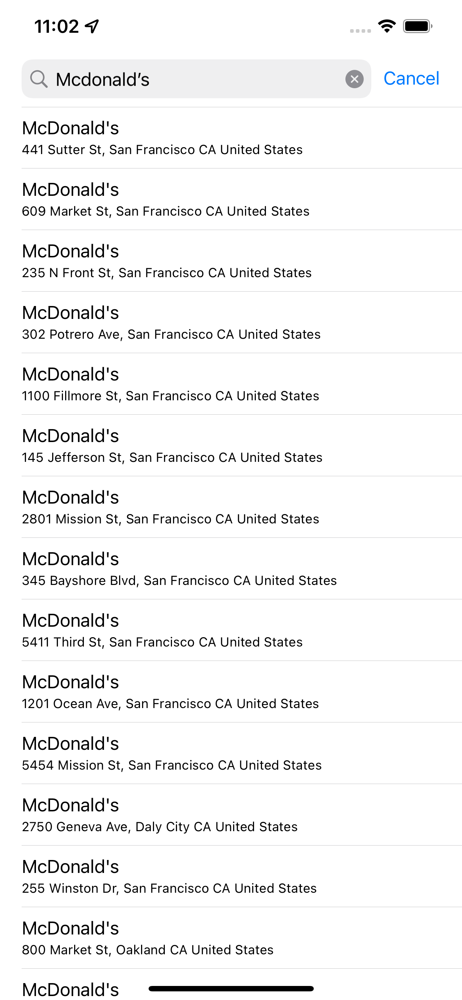

```{r setup, include=FALSE}
knitr::opts_chunk$set(echo = FALSE)
```

### Using Apple Maps 

The application incorporates Apple's most up to date privacy guidelines. Certain features are available depending on the user's comfort level providing location data. If the user allows location, the map will focus on their current location.

### Location Search Controller 

The user can enter in a location to annotate the map. The search controller uses data from Apple's MapKit to respond with real live locations data like address, lng/lat, and place name. The location data cheats and looks for locations nearest you. 

### UIButton 

This is a password protected application for encrypting information on your device. Once unlocked with your password the user has a UICollectionView to store data. 

### Programming the constraints

Proper construction of constraints allows your application to scale to smaller devices like the iPhone 4 and bigger devices like the iPhone 10. The code for specifying the constraints for these 9 buttons is much more efficient than using storyboard for all 9 UIButtons. 

### UITableViewController 

A UITableViewController is one of the most frequently used ViewControllers alongise the ever more popular UICollectionView. This is a scrollable feed where user's can see their friends posts. 

### Programming a UITableViewController

It is not that much code to programatically create a UITableViewController. However, there is another class for configuring the cell. The UITableViewCell class is a template that contains a UIImage and UITextView, but can be customized further. 


