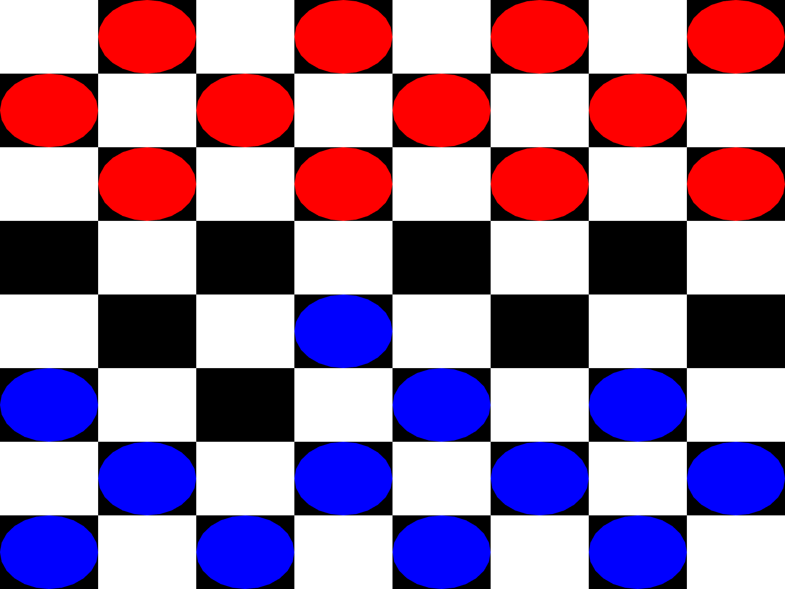
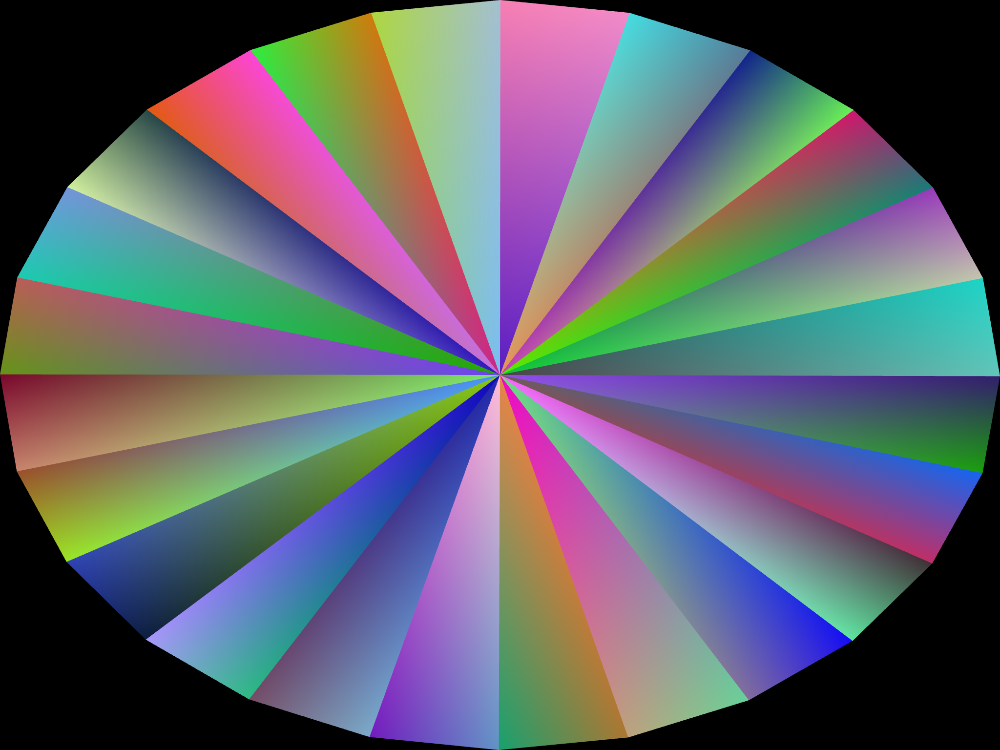
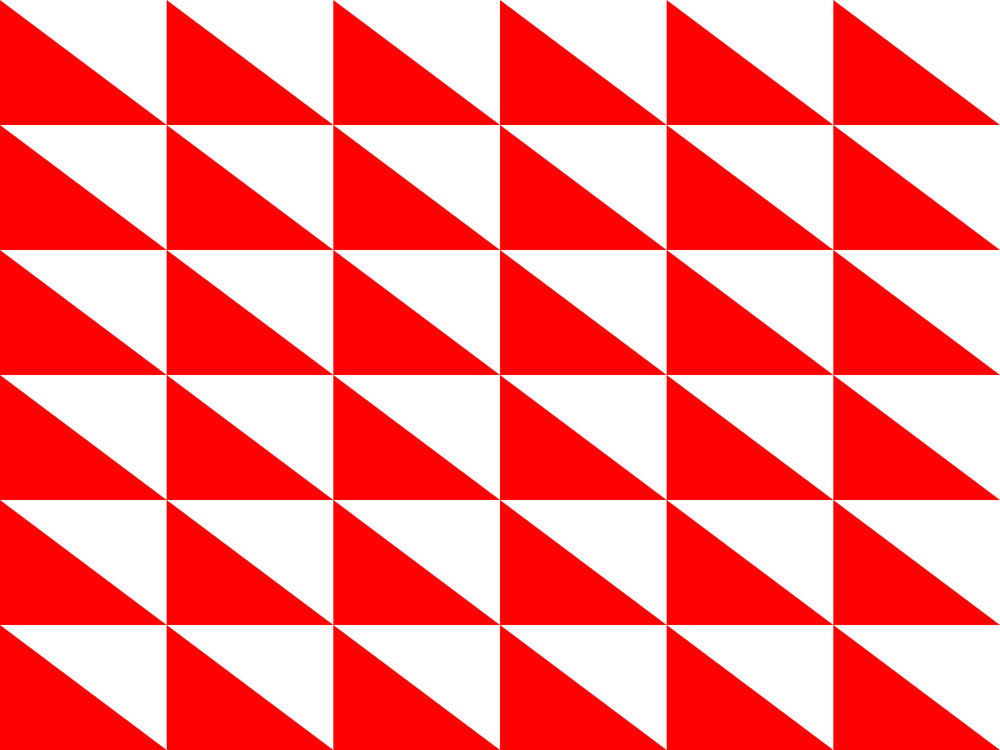

```{r setup, include=FALSE}
knitr::opts_chunk$set(echo = FALSE)
```

### Checker board 

There is an algorithm which determines what moves are permitted for each checker piece. The user can select any valid piece and move it to any valid square. When a hit is made the opposing piece is eliminated from the game. There is a mode where the user can play against an agent trained using artificial intelligence.  

### How it's made - checker piece 

To make a checker piece one must draw a lot of triangles in a shape to resemble a circle. By adjusting the sine and cosine of 2/3rds of the coordinates we can closely resemble a circle with enough triangles. It also wouldn't be possible without the help of radians.  

### How it's made - checker board

Everything in OpenGL is just a triangle. All the 3 coordinates for each triangle must be calculated manually. Along with an red, green, blue, alpha value in the range 0-1 for each corresponding (X, Y) coordinate. Then a buffer is binded to OpenGL and a call to the glDrawArrays() function is made. We specify the vertex shader than the OpenGL engine assembles the triangle shape, rasterizes it, fragments it, and blends it. 

### Artifical Intelligence

[Here is a video of the two AI agents playing each other ](https://www.youtube.com/watch?v=7y1m0Ol24jI)

To give the agents life, we implemented the alpha beta pruning algorithm. This gives the agent an advantage as they are able to look many moves ahead and decide the best move. As one can see from the end of the video, the agents figure out a way to keep playing forever therefore protecting themselves from being taken out. It should also be noted that the two agents do attempt the same moves every time they play each other. Also, another rule must be added to the game logic to protect against stalemates.  


