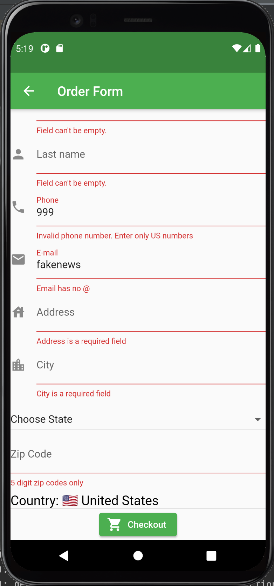

```{r setup, include=FALSE}
knitr::opts_chunk$set(echo = FALSE)
```

### Launch Screen


### Cookie Menu

A menu to browse cookies and add to your cart. When you are at the cart, you are can return to the menu and edit your order. Once you are finished with your order you are taken to a form to fill out cookie order information. 

### Order Form

Information is verified to be correct like a valid phone number and email address. A drop down menu is expanded to select the proper state and only orders from the USA are currently accepted. 

### Database

This page fetches data from the database so the scout can view order information for their customers. 

### Stats 

Data visualizations to see trends in cookie sales and track inventory. 

### Events

Scouts have the ability to create events so people can be notified when and where they are selling cookies. 


