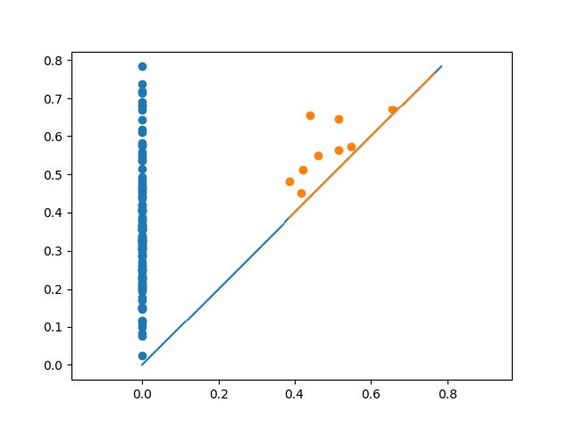
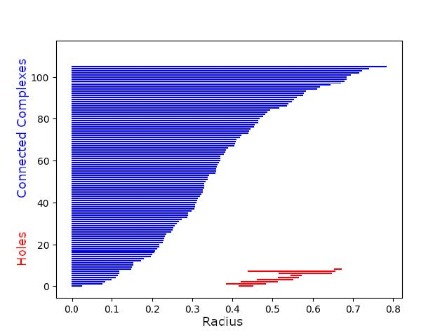
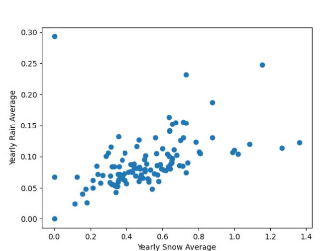
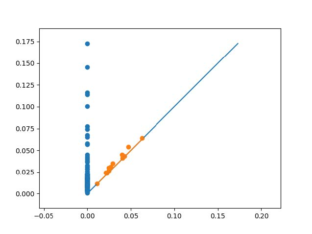
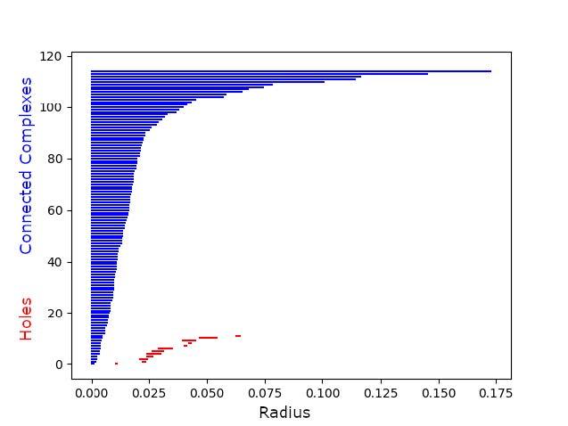

```{r setup, include=FALSE}
knitr::opts_chunk$set(echo = FALSE)
```

**Topological Data Analysis Final Project**

An Analysis of Tahoe Climate Data

**Thomas Smale, Josh Meadows, Alex Richards, David Coles**

Mathematics\
California State University, Chico\
United States\
28 April 2021

[Click to view the pdf version generated with Latex](
https://github.com/jmeadows4/MATH399-Final/blob/main/TP_Final_Project.pdf)

# Introduction {#introduction .unnumbered}

One of the most pressing matters on any college campus is climate
change. Climate change is an issue that affects everyone in this world.
As humans have evolved scientists believe that human actions are harming
the planet. This is causing more extreme weather that is disrupting many
natural habitats. As a result there may be enormous loss of both animal
and human life. As students of a California State University, we have
grown up in this beautiful state and come to appreciate the ground
underneath us. We are concerned that human induced changes to the
climate may result in our beautiful state turning to a dry desert.
Working together and combining our backgrounds in math and computer
science that we have learned at Chico State, we are going to apply
groundbreaking methods to study our climate. One of the most beautiful
regions in California is Lake Tahoe. It offers year round outdoor fun
and our state depends on it for many resources. Since it is such a
special place, people care about it and would hate to see it be
destroyed. At 6,000 feet of elevation in the winter time it is cold and
snowy, but warms up in the summertime with warm California blue skies.
This diverse climate gives us many different aspects to analyze.

The data comes from the National Oceanic and Atmospheric Administration
also known as NOAA, a federal government organization that documents
climate all over the country. Government workers have been collecting
daily data about the weather at its station in Tahoe City since 1903.
This gives us over a 100 years of reliable data to analyze. These data
points are available in a csv file that is about 43000 lines long. The
data is multi dimensional as it has fields such as temperature, amount
of precipitation, and 15 different weather types. We will combine all of
these dimensions into a point cloud to study its shape. We will then
analyze the data using topological data analysis to study its
qualitative features.

Topological data analysis is a great way to deal with multi dimensional
data that traditional methods struggle to extract value from. We will
also use traditional methods such as scatter plots or line plots to
visualize the data. This is to help with our understanding of the data
set and confirm our conclusions. However, we expect that using
topological data analysis will provide us with information about the
data not seen in the traditional graphs. Using data analysis we will be
able to withdraw trends about the data such as if the temperatures are
increasing or the amount of yearly snow is steadily decreasing. From
this we will learn more about how the climate has been changing in
Tahoe, which may be a reflection of the weather patterns across
California.

The amount of data being collected in the world is an unbelievably large
amount that increases with each day. Data can consist of our network
traffic, social media accounts, and grocery receipts. Processing all of
this data is an extreme challenge and those who can make sense of it are
rewarded. The market size for data science is increasing as companies
look to gain a competitive edge by utilizing data to make better
decisions. Data analysis is no easy feat as the size of the data,
noisiness, dimensions, and incompleteness cause challenges. There are
many different ways to analyze data but in the last 15 years topological
data analysis has been recognized as useful in dealing with high
dimensional complex data. Topological data analysis is a combination of
algebraic topology, computational geometry, computer science, and more.
It measures the qualitative features of data by computing the persistent
homology which utilizes algebraic topology.

Topological Data Analysis allows effective and thorough examinations of
all this data. In the case of Tahoe weather data there are some severe
issues that needed to be overcome to be able to properly analyze the
data. One such problem is the data set was first started in 1903, over
118 years ago. This creates issues where there is occasionally
incomplete data spanning large gaps in time. There are also new data
types added over time, such as snow, minimum temperatures, and maximum
temperatures. Not only do all those issues arise, but the scale of the
data is a problem that is hard to overcome. With 40,000 lines contained
in the CSV file, each containing one to six pieces of data, it is
understandable that being able to quickly analyze the data is a problem.
As interesting as it would be to apply all the data and use TDA to
analyze it, the data set is not suited for analyzing in a realistic time
frame simply due to lack of proper computing power for the job.

The were many mechanisms involved to solve the gaps in the lack of data
as well as the scale of it. One such mechanisms was obtaining yearly
averages. As each data point was a day, spanning over a hundred years it
was much more feasible to receive yearly averages than trying to process
everyday, as the computations for every piece of data would take far too
long. To also remedy this we are hoping to leverage a software package
called Dionysus. Dionysus is written by a student who studied under
Gunnar Carlson, Edelsburg at Duke, and is currently at Lawrence Berkeley
Laboratory. It is written in C++ with a python interface. C++ will give
the library its speed, while python will provide a interface that is
friendly to work with. As a whole this will make the process proceed at
a much faster pace. Another software package that has promise is Gudhi.
Gudhi, similar to Dionysus, is designed specifically to handle
everything Topological Analysis related. It generates data sets and
visuals based on the presented data with very little need for
modification. This makes the proccess much safer in the event something
was incorrectly done, which leaves the end results as more reliable.

## Vietoris-Rips Complexes {#vietoris-rips-complexes .unnumbered}

We will be using Vietoris-Rips Complexes to topologically analyze our
data. The Vietoris-Rips Complex is a simplicial complex, which means it
is made from connecting points, edges, triangles, tetrahedra,
pentachora, and so on together and it can have totally separate
connected complexes. The complex is created by first taking a point
cloud in $\mathbb{R}^n$, creating balls of equal radius centered at each
of the points, and varying that radius. Each point in the point cloud
gets a point in the complex, and whenever two balls intersect their
points are connected by an edge. Then whenever three points are all
connected to each other, the edges are filled in with a triangle and the
same for four points all connected being filled in with a tetrahedra,
and so on.

Once we have the complex, we analyze its homology. Without going into
too much detail of how this is derived, we will examine how many
different connected complexes there are and how long they last with the
radius increasing and how many holes there are in the complex that are
present for a sufficiently large range of radii. We will not be
analyzing the higher dimensional analogues of holes however, as
computing these would take too much time, they wouldn't last too long
anyway, and finally the data we will analyze will only have two
dimensions, again out of computing power restrictions. Future projects
may want to analyze these though, as with higher computing power those
concerns could vanish.

To view the homology and how it changes based on the radius, we will use
persistence diagrams and bar codes. Persistence diagrams plot each
"feature\" as a point, which will be connected complexes, holes, or
higher dimensional analogues of holes. The $x$ axis is what radius a
feature appears or is "born\" at, and the $y$ axis is what radius it
disappears or "dies\" at. Therefore, there are no points below the line
$y=x$, and the distance from the points to that line indicates how long
the feature lasted which can tell us how significant it was. Barcodes
are similar, the $x$ axis is the radius and each feature gets a bar with
one end being the radius when the feature appeared and the other end
being the radius when it disappeared. The bars are then stacked together
along the $y$ axis and we order them by death, with the ones that died
soonest appearing at the bottom. These give us similar information to
the persistence diagram, but have some differences. How long a feature
lasted is instead indicated by the length of the bar, and we can more
easily see trends in when features die which is especially helpful for
the connected complexes.

## Algorithm {#algorithm .unnumbered}

To start, we decided to calculate the yearly average of the maximum and
minimum temperatures. In short, this was because computation time for
all points was overwhelming, but this is discussed more in the
Evaluation section. When calculating the yearly average temperatures, we
excluded any dates that had minimum or maximum temperatures missing for
simplicity. Here is our final implementation to create our yearly
averages:

```{python eval=FALSE, echo=TRUE}
    with open('report/tahoe_city.csv', newline='') as csvfile:
        #Use DictReader so list doesn't contain header row 
        climatereader = csv.DictReader(csvfile)
        average_max = 0
        average_min = 0
        # keep track of number of dates in year to take average
        num_dates_in_year = 0

        for i,row in enumerate(climatereader):
            if row['TMIN'] != "" and row['TMAX'] != "":
                # Another date counted for the current year
                num_dates_in_year += 1
                average_min += string_to_float(row['TMIN'])
                average_max += string_to_float(row['TMAX'])

                # Get the year of the current row we are on. Date format is 
                # YYYY-MM-DD, so we split by "-" and get the 0th element(the year)
                row_year = row['DATE'].split("-")[0]
                # If we are starting a new year
                if row_year != cur_year :
                    cur_year = row_year
                    yearly_maxtemps.append(average_max / num_dates_in_year)
                    yearly_mintemps.append(average_min / num_dates_in_year)
                    num_dates_in_year = 0
                    average_min = 0
                    average_max = 0
```

The next task at hand was to create a point cloud from the data we had.
It is important that our cloud had the correct dimensions that Dionysus
expected. Because we had multiple one dimensional arrays, we had to
combine them to make one large multidimensional array. There are many
ways that one might do this, but we chose to use a convenient numpy
function:

```{python eval=FALSE, echo=TRUE}
    point_cloud = np.vstack((yearly_mintemps,yearly_maxtemps)).T
```

At this point, we have set up the point cloud, and are able to use
Dionysus in order to calculate the Vietoris-Rips Complex from the data:

```{python eval=FALSE, echo=TRUE}
    f = d.fill_rips(point_cloud, 3, 2)
```

where 3 is the maximum number of dimensions, and 2 is the maximum radius
of the balls. This function returns a filtration, which we then can use
to get our persistence diagrams and barcodes:

```{python eval=FALSE, echo=TRUE}
    p = d.homology_persistence(f)
    dgms = d.init_diagrams(p,f)
    d.plot.plot_diagram(dgms[0], show=True)
    d.plot.plot_bars(dgms[0],show=True)
```

where the index of dgms is the Betti number.

There were many different directions we could have went with this data
set. We settled on having the minimum yearly average temperatures on the
x-axis, and maximum yearly average temperatures on the y-axis. Sticking
to two dimensions allows us to better visualize the data and verify that
Dionysus is creating barcodes correctly.

Here is a graph of the data:
 And here is an example Vietoris-Rips Complex
with a radius of 0.43:\
\
The image was created using matplotlib by scattering the points,
plotting circles with centers at each point, and then plotting lines if
any two circles intersect. Two circles intersect if the distance between
the two points is less than two times the radius. In the image, we can
see that there are two prominent holes, which we expect to see in the
barcodes and persistence diagrams for Betti 1.

Now that we have a visualization of the Viertoris-Rips Complex, we can
analyze the persistence diagrams and barcodes to see if the holes we
observe above are reflected in the diagrams.

## Temperature Analysis {#temperature-analysis .unnumbered}

Here are the persistence diagram and bar codes obtained from Dionysus:\
\
The persistence diagram plots when a feature was created against when it
vanished, if ever. In this persistence diagram, the features represented
are connected complexes in blue and holes in orange, with the values
being the radius of the Vietoris-Rips Complex at which they appear or
disappear at. For a point, if those two values are very close together,
that means the feature disappeared quickly after it appeared and thus
isn't as significant. In the diagram this can be seen as the distance
from the point to the line.

Due to the nature of the Vietoris-Rips Complex, all simplicial complexes
start immediately as there is always a point at which none of the balls
are touching and each ball contains only the point it is centered on.
Then there cannot be any new complexes, as increasing the radius only
causes the balls to begin to intersect and simplicial complexes to
merge. This merging is what is shown in the persistence diagram as
complexes vanishing.

Because of how the persistence diagram displays the connected complex
data with lots of overlap in the points, it is harder to see any trends
so we look at the barcodes instead. This shows that the radii at which
complexes die are fairly evenly distributed. This shows that there was a
wide variety of densities within the point cloud, with some points
clustered together and others farther apart from other points. As there
are a number of complexes surviving with higher radii, we can surmise
that there are some outliers that are reasonably distant from the other
points in the point cloud. We can also speculate that the more even
distribution may be in part due to the yearly averages being taken
instead of the full data set. Without that truncation of data, there
could be more intermediate points that cause the complexes to collapse
more quickly, while making the points that are outliers more clear.

Holes in the data mean that there were spaces surrounded by points
nearby each other that had no points in them. The shorter they last, the
more likely they are to just be noise in the data caused by a random
variation in the measurements that happens to result in a hole in the
data. In the persistence diagram, we can see a few holes that may be
significant. This means that the yearly averages do not completely fill
the interior of the of the graph, leaving the larger holes.

## Precipitation Analysis {#precipitation-analysis .unnumbered}

With precipitation and snow we retrieved the values in a way similar to
the previous data involving minimum and maximum temperatures. In this
case we compared snowfall on the x-axis and precipitation on the y-axis
for our visualizations. To come up with our data points we found the
averages for each year, but unlike before, this data includes both
precipitation and snowfall as long as one or the other has a valid piece
of data. Otherwise empty data from both precipitation and snowfall is
discarded.

Having two dimensional data for the rain and snow was found to be the
best way to handle plotting our points. This also allows us to verify
the results from Dionysus as well as Gudhi were presented without error.
The generation of the point cloud allows us to learn more about the data
we are working with. By using Gudhi, another software package, and
Dionysus we were able to generate figures for both the persistence and
bardcodes of this data set.

Presented is the point cloud of this input data:

::: center

:::

Here we have the persistence data and the barcodes, again from Dionysus:

::: center
 
:::

We will use the previous analysis to help us understand this new set of
data. First, the holes last for very little time, as we see they are all
clustered near the line in the persistence diagram and their bars are
all very short. This means the data largely saturates the area it takes
up, with no large spaces with no points that would create holes.

Second, we notice in the bar codes for connected complexes that most of
the complexes merge quite quickly. This tells us that much of the data
is clustered quite close together. After most of them merge, there are a
small number of complexes which take a lot longer to merge. This means
there are a number of outliers in the data, which we can clearly see in
the point cloud.

# Conclusion {#conclusion .unnumbered}

We attempted to analyze our climate data using topological data
analysis, a field that has grown in popularity over the years. We
originally hoped to potentially gain new insights on the data, but this
became unrealistic as we lacked in the computational power to run
topological data analysis algorithms on a data set this large. Because
of this, we down-scaled tremendously, and decided to focus on two
categories from our data, maximum and minimum temperatures. This was an
unfortunate compromise, as we feel our results may have held more value
if we were able to use more data points, or increase the number of
dimensions. More computational power would have allowed us to explore a
fuller range of possibilities with our data set.

Despite these setbacks, we were able to analyze the data appropriately
using topological data analysis, and ended up getting results that were
easy to understand. For maximum and minimum temperatures, it was clear
to see from our persistence diagrams that there were two long-lasting
holes in our point cloud, that both lived and died at roughly the same
time. While it is unclear whether these holes are significant, it is
worthwhile to note their similar birth and death times, which may lend
clues to the shape of the data. For the yearly snowfall and rainfall
values, we found that much of the data was clustered tightly together
due to a lack of longer-living holes and that most of the connected
complexes merged together quickly. There were also a number of complexes
that took longer to merge together, meaning there were a few years that
were outliers from the bulk of the data.

There are a lot of interesting insights that could be made from this
data. In the future, it would be worthwhile to explore the relationship
between the different categories of data, potentially in more than two
dimensions. It is clear that the results of the topological data
analysis tools we used were consistent with the visualizations of the
point cloud we made in two dimensions. This is promising, and gives us
confidence to move to higher dimensions, where visualizing the
Vietoris-Rips Complex is no longer an option.

We also have created usable skeleton code for reading in data sets,
translating them into meaningful data structures, and utilizing Dionysus
in order to get the persistence diagrams and barcode. On top of this, we
created a way to animate the Vietoris-Rips Complex as the radius grew.
This will be applicable to other data sets as well, when considering
whether or not they would be a good candidate for topological data
analysis.

Overall, we gained new insight on topological data analysis, and how it
can be applied not only to our specific data set, but any general data
set. While the persistence diagrams can be a bit more confusing than
traditional data analysis methods, it is undeniable that there is
significance in them. While topological data analysis might not be the
best option for certain data sets, it is a worthy option to consider. We
look forward to using these newfound skills on future data sets to try
and extract meaningful information.

# References {#references .unnumbered}

Otter, N., Porter, M.A., Tillmann, U. et al. A roadmap for the
computation of persistent homology. EPJ Data Sci. 6, 17 (2017).
https://doi.org/10.1140/epjds/s13688-017-0109

J. D. Hunter, "Matplotlib: A 2D Graphics Environment\", Computing in
Science & Engineering, vol. 9, no. 3, pp. 90-95, 2007.

Python Library Dionysus by Dmitriy Morozov

GUDHI User and Reference Manual, The GUDHI Project, GUDHI Editorial
Board, 3.4.1, 2021, "https://gudhi.inria.fr/doc/3.4.1/\"

Past Weather by Zip Code - Data Table. Past Weather by Zip Code - Data
Table \| NOAA Climate.gov. (n.d.).
https://www.climate.gov/maps-data/dataset/past-weather-zip-code-data-table.

# Evaluation {#evaluation .unnumbered}

We encountered several challenges during this project. To start,
documentation for Dionysus is fairly sparse, and unfinished. It was
unclear what format Dionysus expected the point cloud to be in, the
syntax of the filtration returned by the Vietoris-Rips function, and
what to do with the filtration once we had it. Another struggle we
encountered was the amount of computation time that calculating the
Vietoris-Rips Complex took. At first, it was very hard to pinpoint the
issue, because the program would never come to completion. Even after
cutting our data size in half, it would still run for an indefinite
time, with one notable run taking over 2 hours before it was force-quit.
In an effort to see if the program would ever complete, we used around
100 points, which would take at most a minute to two minutes. We decided
this was a range that we felt comfortable with, and decided to instead
take the yearly averages of the data, in order to decrease the size of
the point cloud.

To download the csv files from NOAA one must fill out a request with the
desired fields. There were limitations to the data requests, like the
file size must be under a gigabyte. So the fields and years were
strategically chosen to be just less than a gigabyte. Some requests took
a few days to be fulfilled when it was supposed to take no longer than
24 hours. All of these values were inputted as strings even though the
values for fields like temperature were integers. So each row that was
read in needed to be casted to its appropriate value like an integer or
floating point value. There are many ways to read in a csv file in
python, but the most elegant was the dictionary reader because it did
not include the first row which is the title of all the columns.

There were also several elements of the project that went particularly
well. We were able to plot the data with ease, and even made an
animation of the Vietoris-Rips complex with an increasing radius. This
helped us visualize the data and try and make sense of our diagrams and
barcodes. Another method we used the visualize the data was using
Matplotlib. This was a new library which required some getting used to.
The input for these graphs are one dimensional numpy arrays which were
different than our multi dimensional arrays. Our scatter plots also had
too many points for Matplotlib to display in a readable format. This
required breaking the problem down into smaller ones by decreasing the
data set without compromising its integrity. It became a very powerful
tool as we learned how to customize our graphs by manipulating their
properties like size, axes, and style. As we became more used with
Matplotlib we were able to utilize it to visualize graphs to see what
would be most useful to apply Dionysus too.

The four of us spent at least 20-30 hours on this project. A good amount
of time was spent trying to work with our csv file and Dionysus, but the
main portion of our time went to examining our results and trying to
find meaning from them. We also found notable issues with applying the
data to TDA. When handling the information, certain visualizations and
graphs came out looking very clumped, which made the data much harder to
truly understand. This mostly occurred when plotting the vietoris-rips
where we had a large grouping of lines and bubbles that blended
together. Overall these issues did not hinder the progress of the
project. Throughout the course of the project we were all very self
sufficient and were able to find resources for help if needed, but we
mostly all helped one another meet goals.


