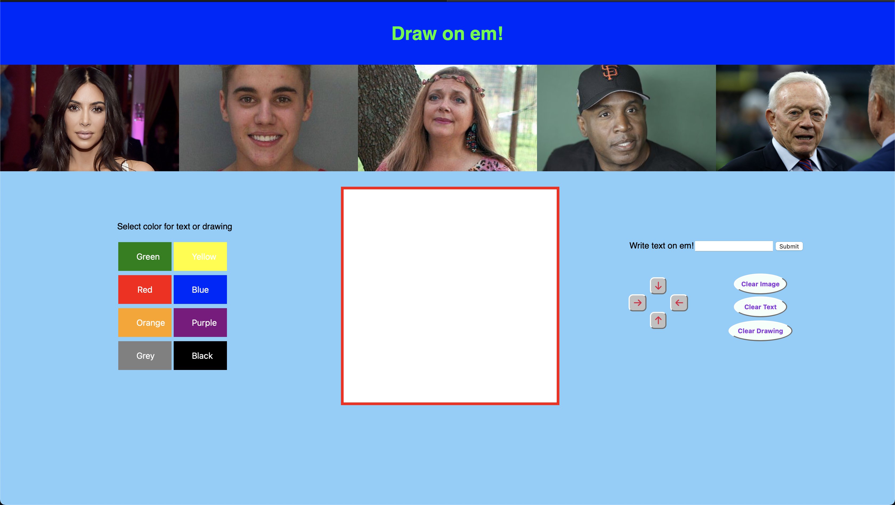
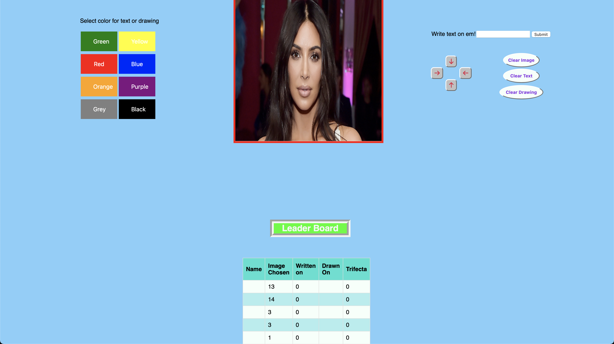

# DrawOnEm
Poke fun at some of the most controversial public figures by drawing on them! 

This is curretnly just the client side in a full stack project. For security reasons, I am not uploading the Node.JS, Express, or MySQL, but I will be hosting it publically when I have free time. 

This is screen as you open the application. Players can draw on the canvas or select an image and draw on top of the image! 

Are you heartbroken that Justin Beiber broke up with Selena Gomez or that he pissed in a bucket and screamed "F Bill Clinton"? Well here is your chance to get back at him, take your anger out in a non violent manner and explore your artisitc side. 

Want to draw for fun, or write silly text, draw using your mouse in the white canvas. Enter text then move it around the canvas using the arrows. 

If you are curious to see who is selected the most to draw on, view the database which updates everytime someone selects an image to edit. 
