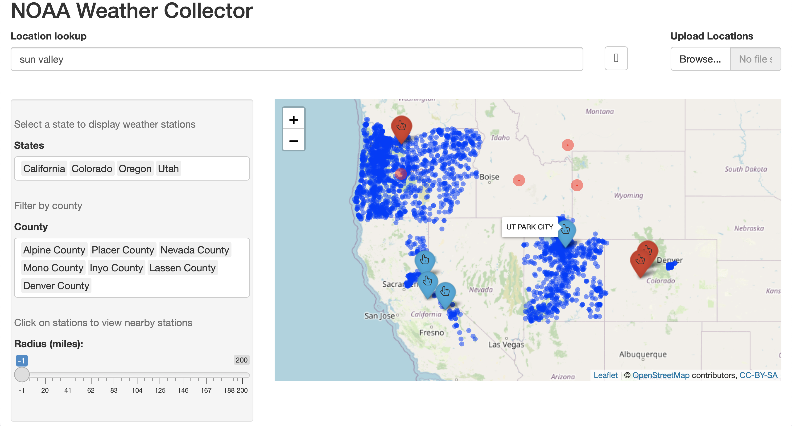
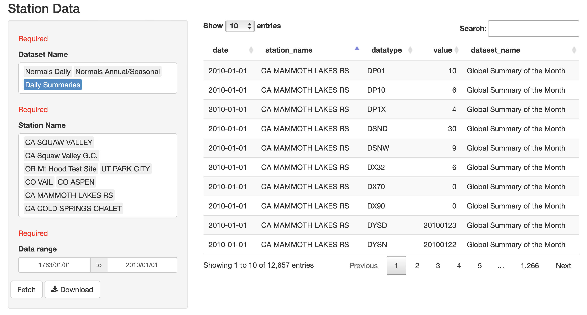
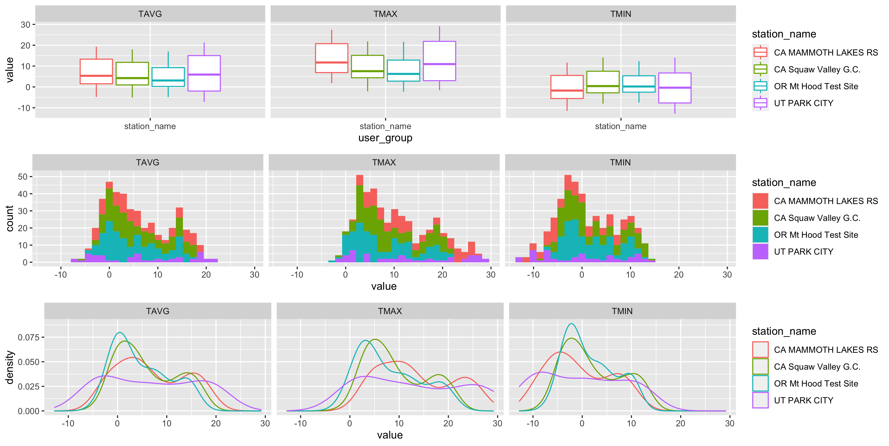
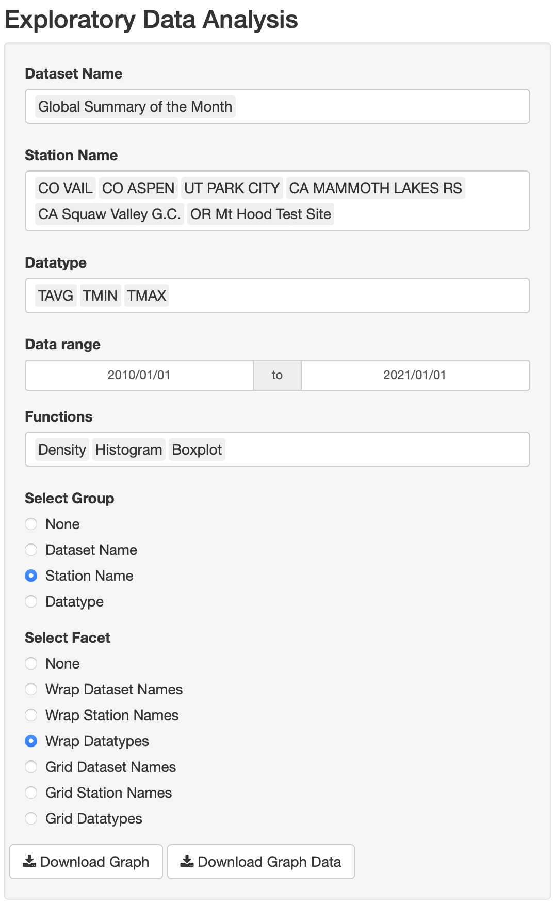

```{r setup, include=FALSE}
knitr::opts_chunk$set(echo = FALSE)
```

# Intro 

This will take you through a run down of using this application to compare weather data for a variety of different ski mountains. However, feel free to use the application yourself by clicking this link. 

* **Link to Application:** <https://weathercollector.shinyapps.io/capstone/>

The purpose of this application is to provide easier access to publicly available weather data. NOAA, under the U.S. Department of Commerce has 1.4 billion and counting rows of weather data available to the public. However, accessing this data is very confined on it's website. This application provides a solution to this by working directly with the NOAA API and giving user's an alternative user interface. 

# Finding Weather Stations



There are a variety of parameters to access NOAA stations. User's attention will first be drawn to the map. Here user's can view weather stations according to state and county. For more precise result's user's can search locations in the search bar. This is hooked up to the Google places API so user's can search places like Sun Valley ski resort. The application will mark these locations with a red circle. User's can click red and blue circles, then apply the radius filter to get all stations within a certain amount of miles from the station. 

Underneath the map the user is shown a list of stations present on the map. The user is able to see a summary of the stations. The summary includes information like the date range of data available for the station and the different kind of data sets available. This allows the user to be more informed about the kind of data the user can request. It is important for the user to know what data they are fetching because if they are getting Daily Summaries for Park City Utah, they will be fetching over 200,000 observations. 



Here the user has successfully fetched weather data for a few ski mountains. The user is presented with a table which they can use to organize the data using a few different parameters. The left show's the data they have fetched for, and modifying the contents of that panel will affect what is shown on the table. The user can download the data to perform their own data analysis. 



The user can then perform exploratory data analysis to visualize the data from within the application. They can use a variety of parameters to graph the data. 



These values can be controlled to display what is graphed. For example, if the user does not wish to graph data from Squaw Valley, they can delete it then that data will not be displayed. There is also the ability to adjust the X axis to control the number of year's being plotted. 

This web application was built entirely using the R programming language. There is a framework called shiny that translates the R code into HTML, bootstrap CSS, and Javascript. This allows anyone to access the statistical powers of R. Shiny apps are able to be easily hosted using shinyapps.io.


