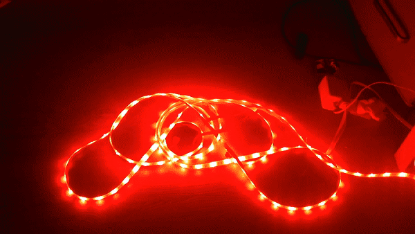
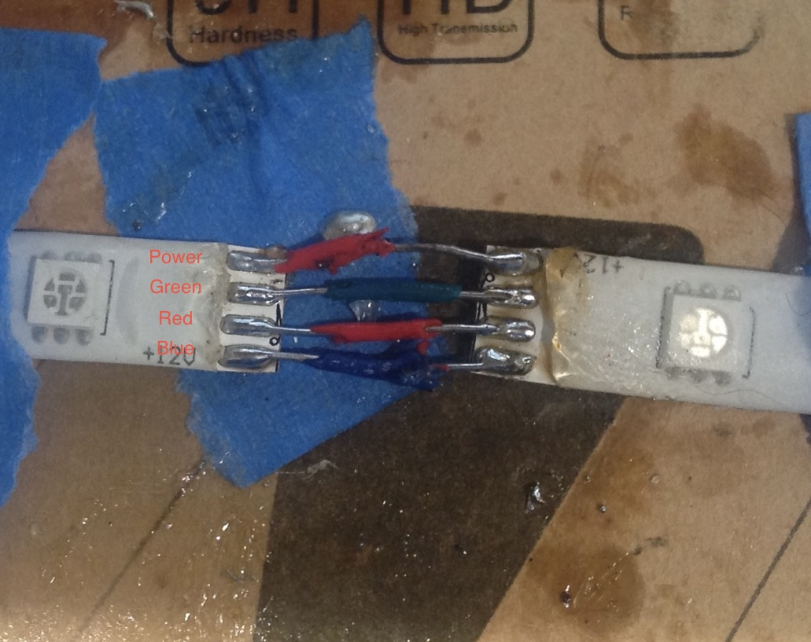
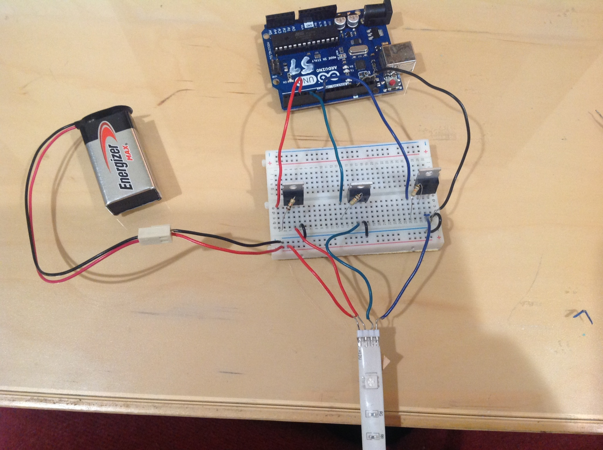
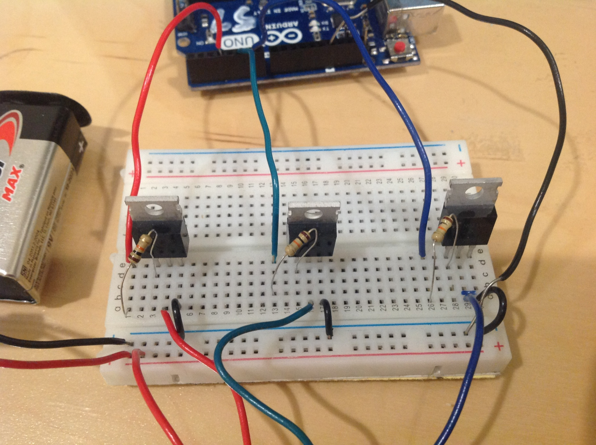
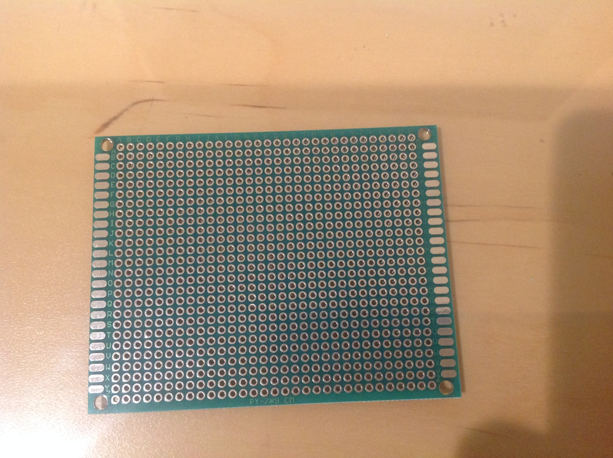
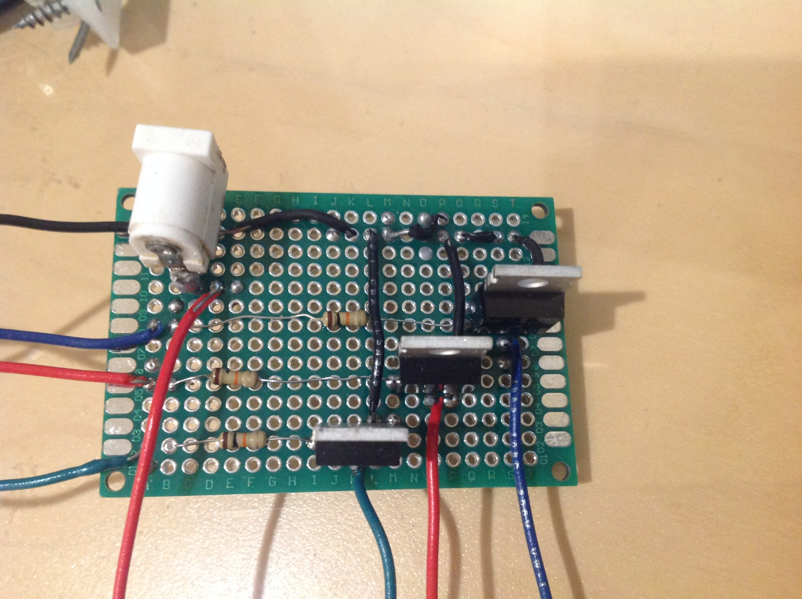
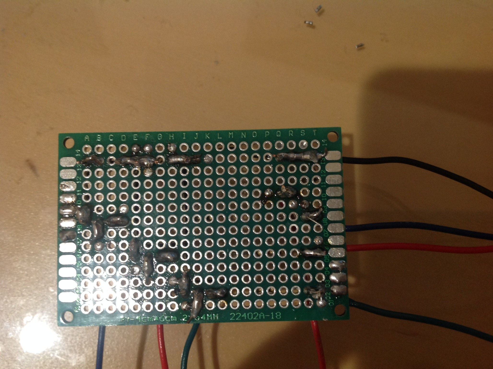
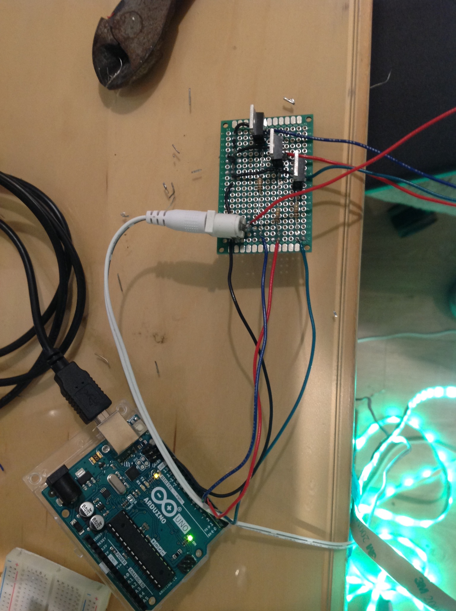

```{r setup, include=FALSE}
knitr::opts_chunk$set(echo = FALSE)
```


# Intro

It was Christmas time and our house was looking rather dark. I had some LED strip lights laying around with a remote. The problem was that the remote was very limiting. The remote could turn the lights green or red, but not toggle between the two. Time to break out the Arduino and unleash the full power of these lights! Let there be light! 

By using an Arduino we can control the current being sent to the LED lights by writing a C like program. By manipulating the current we can change the RGB LED's to any color of our choosing. By manipulating the timing features of the Arduino through something such as Pulse Width Modulation (PWM) we can get the LED's to do some cool features as shown below.




[strobe](https://youtu.be/ucXJvkmJgZ8)
```{r}
library("vembedr")
embed_url("https://youtu.be/ucXJvkmJgZ8")
```

## Materials
- Arduino UNO
- 12V LED light strip
- MOSFET transistors
- 10K ohm resistors
- Input/output barrel jack connectors  
- Jumper cables
- Breadboard or Prototype board
- Soldering iron and solder (optional)
- Arduino IDE 

## Hardware

This will walk you through the process of turning these lights into one's that Santa will put you on the nice list for. These LED lights feature 4 pins. Unfortunately, each LED is not individually programmable. 


The wires connecting to the LED strip lights are set as follows (from top to bottom) Power, Green, Red, and Blue. Maybe I should have changed the color of power cable or red cable to not have 2 cables colored the same. However, I wanted to keep the classic power as red, and it wouldn't have made much sense to have a red cable colored yellow. So just be aware of this moving forward. 

The Arduino can only receive or transmit a max of 5 volts. The LED lights I had required 12 volts of power. If I were to send 12 volts through one of the Arduino pins it would fry the board. With how expensive chips are right now, I didn't want to do that. So the solution was MOSFET transistors. These act as a gate between the 12V external power supply and the arduino. As long as the connection between the 12 V lights and 5V Arduino travels through the MOSFET, the Arduino will be safe. 

The MOSFET transistor has 3 pins, a gate, source, and drain (GSD). The wire from the Arduino will go to the gate pin. The wire from the light will go to the source pin. Lastly, the drain pin will be connected to ground. To explain in layman terms (as I'm no expert in this subject matter), the gate pin will open and close the voltage flow to the Arduino. When the voltage exceeds 5V it will redirect the excess voltage to the drain aka ground. All while maintaining the 12V needed to power the LED light strip. 



The MOSFET transistors have 3 legs, gate, source, and drain (from left to right). There is a 10K ohm resistor between each Arduino pin connection and the MOSFET gate. This is to protect the Arduino from a discharge of current it cant handle. The middle pin (source) has a wire that connects to the LED pin. The third leg, (drain) connects to the ground. The power source (battery) is directly applied to the LED lights. The Arduino is powered by a separate, lower voltage supply such as a USB port on a computer. The power source and Arduino are both connected to ground.

The breadboard is great for prototyping circuits quickly. However, it is not very sturdy as cables can easily be dislodged from the breadboard. So for production, something more durable was necessary. So I upgraded to double sided protoboards. These allow for you to solder your components so the connections can be more secure. They are a step above breadboards but a step below Printed Circuit Boards (PCB). 


With some soldering one can copy the breadboard circuit to the prototype board. Keep the breadboard circuit intact while you are making the protoboard circuit. It is handy to use as a reference when something goes wrong such as a missing connection. Since the layout of the protoboard is slightly different, for example, no strips or rails I made a slightly different circuit because it felt more organized.

 The cables branching out to the left connect to the Arduino. The cables branching out to the bottom connect to the LED lights.
 

This shows components that are soldered together. Each MOSFET leg is soldered to an adjacent pin which contains a wire. The top row in the picture could all be soldered together as it is ground. Instead it is about 3 different ground wires soldered together. 

This is what everything looks like hooked up. The Arduino is connected to the USB port of the computer. The barrel jack connector on the protoboard is connected to a wall socket. 


## Software
The code written to make these Christmas lights is publicly available via [GitHub](https://github.com/thsmale/xmas_lights). 

Arduino UNO has a few pins that are pre programmed to use PWM so we don't have to make our own library to do it. The RGB pins are connected to PWM pins which are marked with a tilde ~ on the Arduino board. This is the code to achieve a fade effect on the lights using PWM.

```C
/*
 * pin: 3, 5, 6, 9, 10, 11 as they support PWM
 * time: (milliseconds) how long to wait until the brightness is increased 
 * step: [0, 255] how much to increase the brightness by
*/
void brighten(int pin, int time, int step) {
  int i = MIN; 
  while (i < 256) {
    analogWrite(pin, i);
    delay(time);
    i += step;
  }
}
```

Once you can do a fade effect, you can also do the inverse brighten effect. By combining the two you can get a soothing red green pattern. This is one of the modes and it ran for about 10 minutes long. The first minute it very slowly increases in color, increasing in speed each iteration until 10 minutes has passed. 
```C
//Speed of delay and step are changed
void dynamic_fade() {
  for (int delay = 100; delay < 1000; delay += 100) {
    for (int step = 15; step <= 60; step += 15) {
      brighten(red_pin, delay, step);
      fade(red_pin, delay, step);
      digitalWrite(red_pin, LOW); // some iterations red_pin doesn't reach 0
      brighten(green_pin, delay, step);
      fade(green_pin, delay, step);
      digitalWrite(green_pin, LOW); // some iterations green_pin doesn't reach 0
    }
  }
}
```

By setting the delay to a value of 100 milliseconds you can achieve a strobe effect.
```C
int STROBE = 100; // Milliseconds
while (1) {
  analogWrite(red_pin, 255);
  delay(STROBE);
  digitalWrite(red_pin, LOW);
  delay(STROBE);
}
```

RGB LED lights also open up much opportunity to customize the color. For example, this was my favorite shade of orange.
```C
int MAX = 255;
analogWrite(red_pin, MAX);
analogWrite(green_pin, 1 * (MAX/12)); 
```

The code runs the lights every day from 6 PM to 12 AM. Once the program has run for 6 hours, the Arduino goes to sleep for 21,600,000 milliseconds or until it is 6 PM the next day. 

The code offers about 9 different Christmas light modes. It'll switch between these modes every 10 minutes until it reaches 12 AM. My personal favorite is the Fibonacci code from [0, 255]. Or the Christmas strobe lights (both featured above). On the list for next year, Merry Christmas flashing in morse code. 
