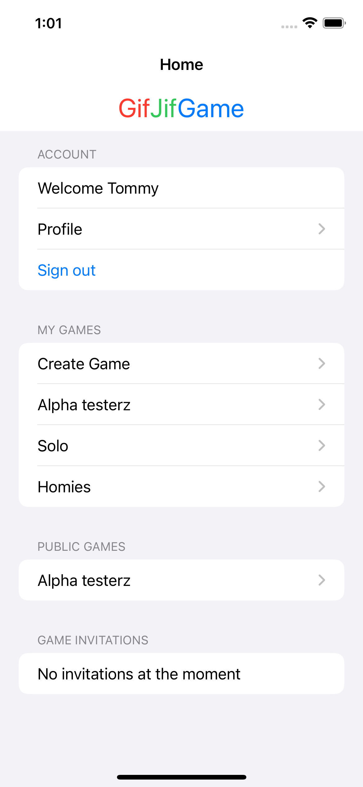
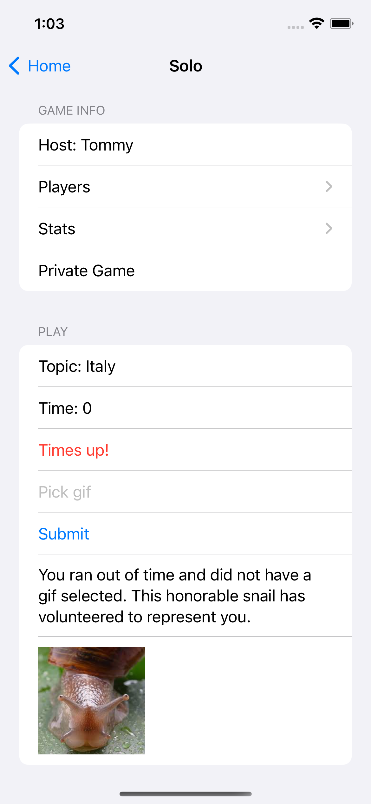
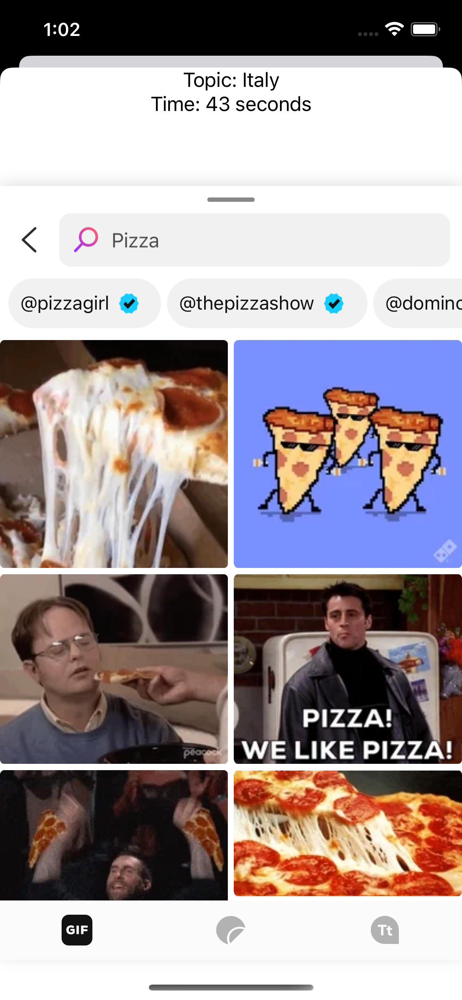
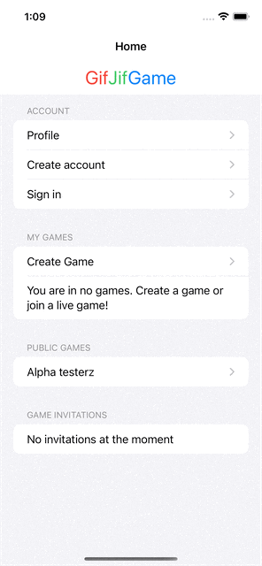

```{r setup, include=FALSE}
knitr::opts_chunk$set(echo = FALSE)
```

The source code for GifJifGame can be found [here on GitHub](https://github.com/thsmale/GifJifGame).



## How to play

In GifJifGame the host decides a prompt. It is up to the everyone else to respond with the best gif they can think of or find within the time limit. The gifs are anonymously sent to the host where the host will pick their favorite. The player who's gif was chosen as the favorite wins a point. 


```{r}
library("vembedr")
embed_url("https://youtu.be/6IlULmveobI")
```

Don't run out of time or this static snail will be submitted for you!


## Giphy
This game uses the Giphy API to provide users with access to the world's largest Gif database. Giphy also provides a SDK Swift programmers can incorporate via a package. The gif picker provided by Giphy is a UICollectionView from UIKit which is not directly accessible from SwiftUI. So to include it in your SwiftUI project it needs to be hacked by using a UIViewControllerRepresentable and UIViewRepresentable.


## Invitations

Players are able to invite other plays to their game in between any rounds or when the game initially starts. To invite a player to the game enter their username. Players must have an account to receive an invitation. Creating an account only requires a username and password.

```{r}
library("vembedr")
embed_url("https://youtu.be/20s05_bQZgA")
```

If users do not wish to create an account they can play in public games. Public games are accessible to anyone with the app. In addition there is a solo mode where prompts are randomly generated and players can search giphy for an pertinent gif. 

## Storage

GifJifGame stores data in two ways, locally and remotely. This means if you change devices one can easily recover all their data because it also resides in the database. User data is stored locally in the Documents directory within the application sandbox. In the scenario below, I am on a new device so my data is fetched from the database.


## Database

Firebase is used as the backend for this project. Each game is stored as a JSON document within a games collection. Each player has snapshots configured so documents can be read and written in real time. Snapshots subscribe players to the games that they are in, so every time a change is made to that game document each player device receives a notification and their app is updated appropriately.  

This is an example function of a user updating their username. Firebase is in a weird place at the moment, it supports async/await syntax but there is more functionality available with closures at the moment. This accepts a Player struct, then encodes it into a map that Firebase will accept. Once it makes a connection with the document in Firebase it will append the Player object to the array of Players already in the game. The function will return true or false if the operation is successful.  

```swift
func add_player(doc_id: String, player: Player, completion: @escaping ((Bool) -> Void)) {
    print("Adding player...")
    let encoded_player: [String: Any]
    do {
        // encode the swift struct instance into a dictionary
        // using the Firestore encoder
        encoded_player = try Firestore.Encoder().encode(player)
    } catch {
        // encoding error
        print("Error encoding player \(error)")
        completion(false)
        return
    }
    let ref = db.collection("games").document(doc_id)
    ref.updateData([
        "players": FieldValue.arrayUnion([encoded_player])
    ]) { err in
        if let err = err {
            print("Error updating document: \(err)")
            completion(false)
        } else {
            print("Document successfully updated")
            completion(true)
        }
    }
}
```

## SwiftUI

In SwiftUI views are very cheap so code can be placed into structures which can easily be reused throughout the project. For example, this view is a search box that looks up other players. It is used within a few different views in the project. It features a text field and when the user presses enter it triggers a query to the database searching for the username. While it is searching the database a spinning wheel will indicate to the user that the app is working on the task. A text box will appear below the search box indicating the status of the search. 

```swift
struct FetchUser: View {
    @State private var username: String = ""
    @State private var invalid_username = false
    @State private var status = Status()
    var action: (User) -> Void
    
    var body: some View {
        HStack {
            Image(systemName: "magnifyingglass")
            TextField("Invite player via username", text: $username, onEditingChanged: { _ in
                invalid_username = false
            })
            .onSubmit {
                if (username == "" || username.count >= MAX_USERNAME_LENGTH) {
                    status.msg = "Invalid username"
                    return
                }
                status.updating = true
                get_user(username: username) { user in
                    if let user = user {
                        action(user)
                    } else {
                        status.msg = "User does not exist"
                        invalid_username = true
                    }
                    status.updating = false
                }
            }
        }
        if (status.updating) {
            ProgressView()
        }
        if(invalid_username) {
            Text(status.msg)
                .foregroundColor(.red)
        }
    }
}
```


