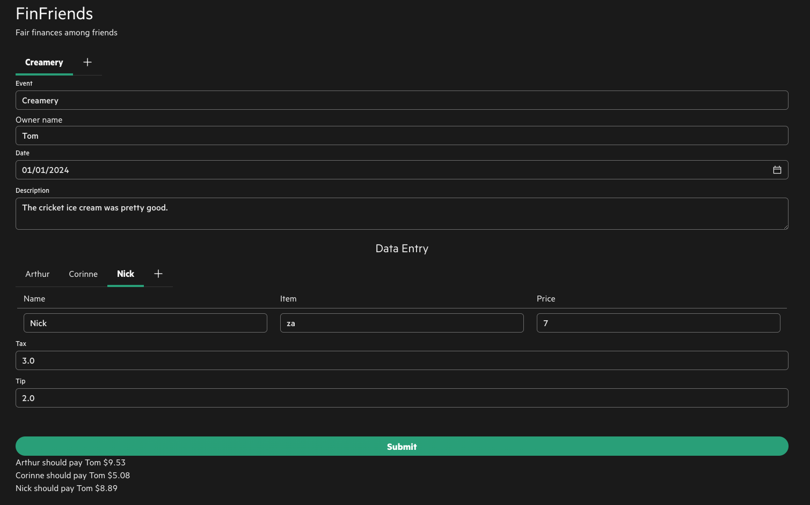

### [-> FinFriends URL](https://finfriends.netlify.app/)

FinFriends computes the least amount of transactions required among friends.

It then displays this data to the user.

This web application is built using React.

The React component library being used is grommet.

React is a Javascript framework for programming front end web applications.

There is a backend API server written in the Python framework fastapi.

The front end sends the bills to the backend server which runs a python script
to compute the least amount of Venmo's required. It then returns these results
to the user in the UI.

### [-> FinFriends Source Code](https://github.com/thsmale/trev-final-proj)