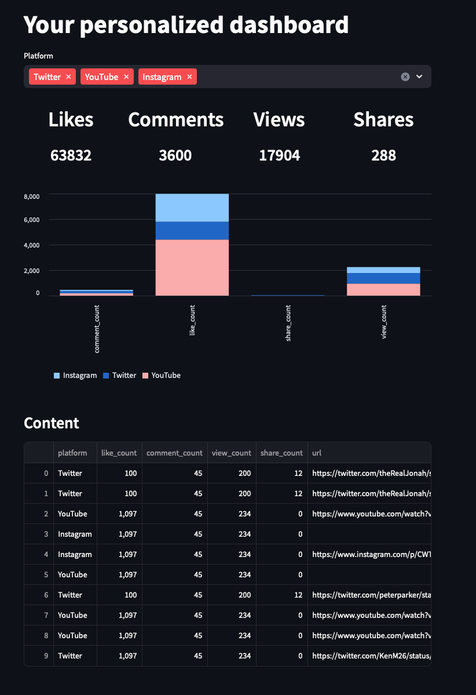
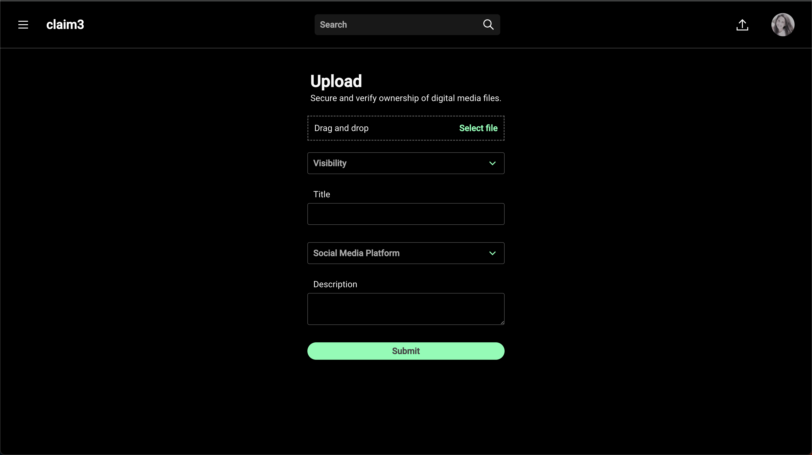
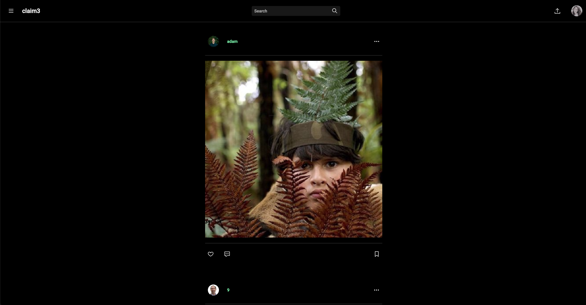
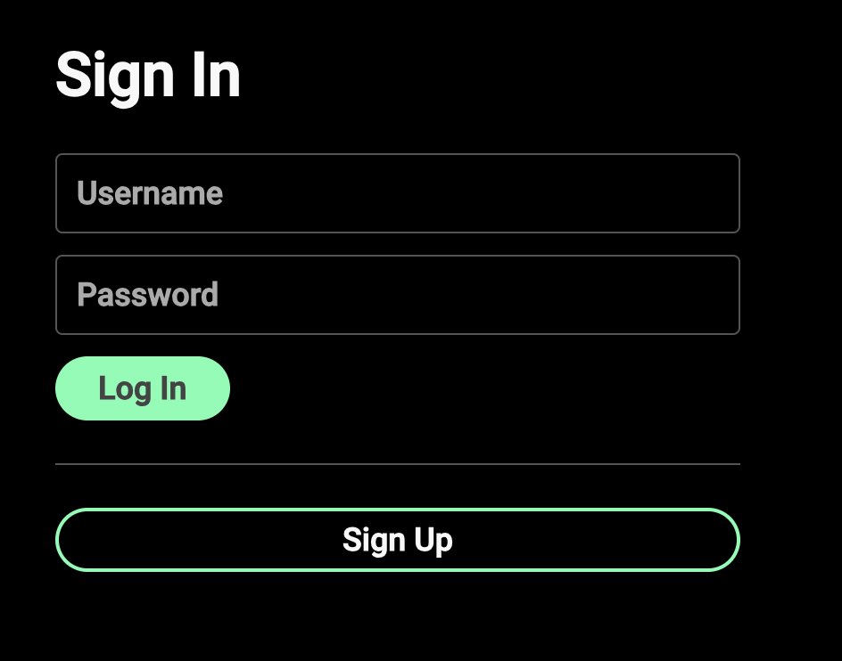
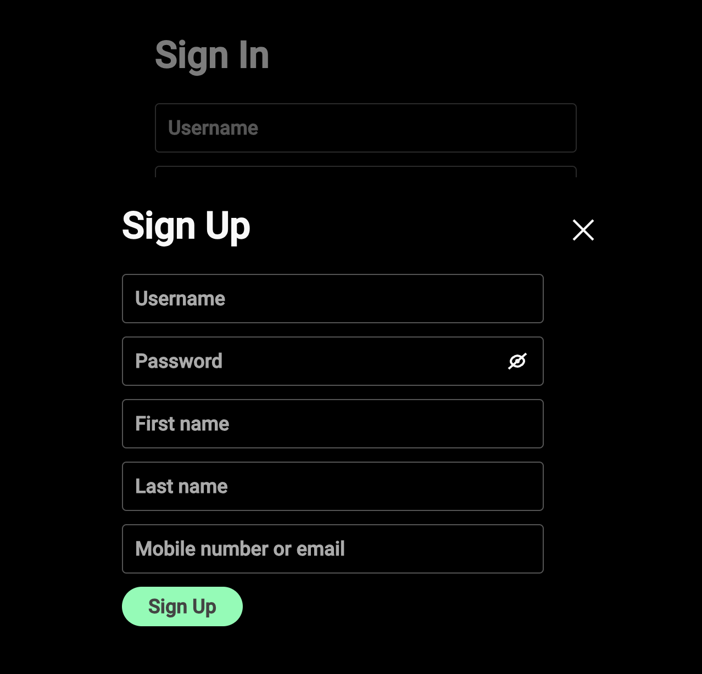

```{r setup, include=FALSE}
knitr::opts_chunk$set(echo = FALSE)
```

claim3 is built with a wide variety of technologies including React, Django, Streamlit, PostgreSQL, and AWS.

### * **Link to Application:** <https://claim3.onrender.com>

Users can view a dashboard which shows analytics of content they have published across the internet.
They can filter their analytics based on a variety of social media platforms.



In addition, they can securely upload files which enables claim3 to track their content across the web.



People can view content uploaded to claim3 in a social media like feed.



One can securely sign in or create an account as shown below.






