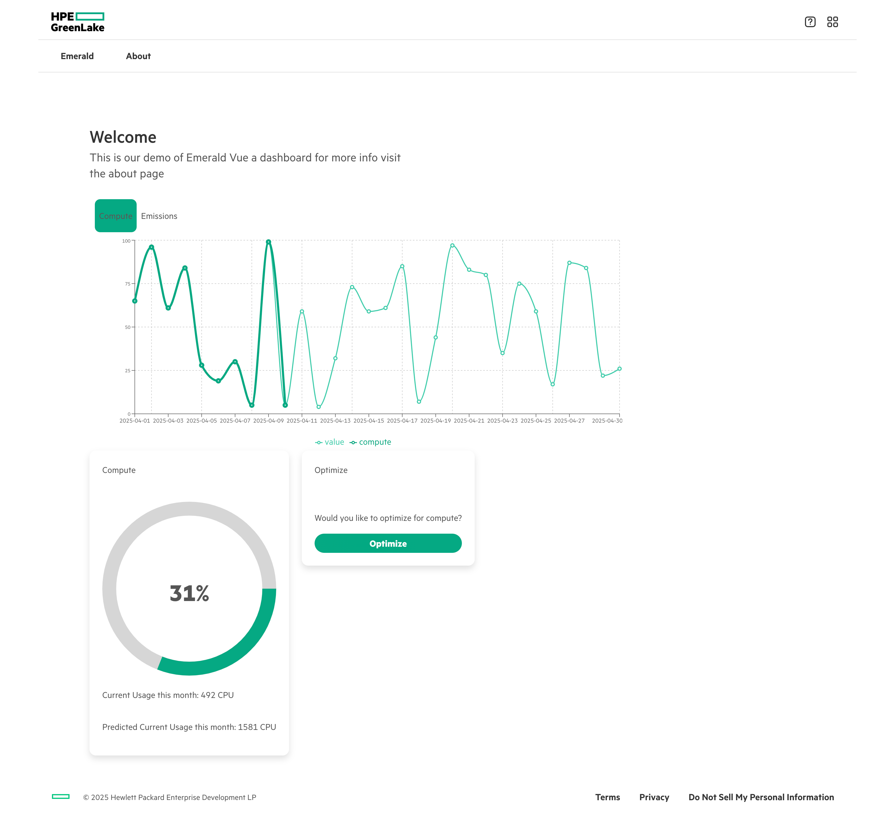
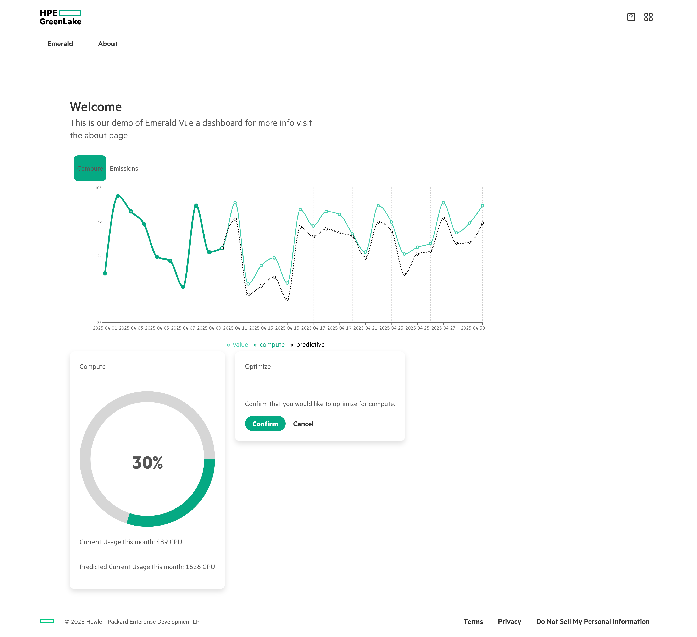
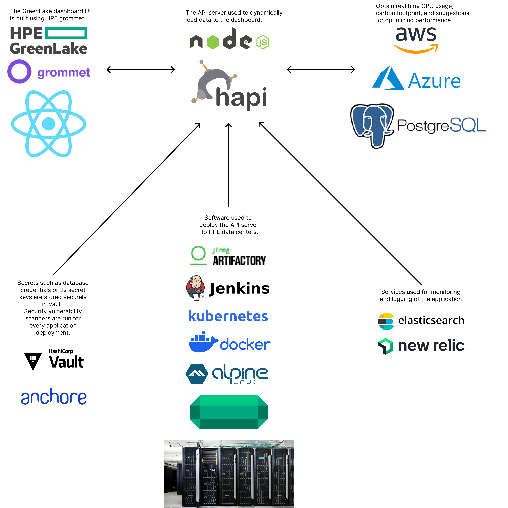

```{r setup, include=FALSE}
knitr::opts_chunk$set(echo = FALSE)
```

# Intro

This is a dashboard that enables users to reduce carbon emissions from a data center. There are processes in place that capture metrics from compute servers, networking equipment, or storage devices. The algorithm leverages this data to optimize resources, such as idling during periods of low usage, so the machines can have less carbon emissions. This helps save the planet while also reducing cost for data centers, it's a win win!

- [Dashboard URL](https://emeraldvue-5d3047c5816b.herokuapp.com)
  - Note the URL may take a minute to load.
- [Source Code](https://github.com/thsmale/greenlake-sustainability-dashboard?tab=readme-ov-file)

## Usage

The following is the view when you open the dashboard.


The algorithm will then show you the optimizations to compute resources or carbon emissions it is able to make. It will ask for confirmation before making the changes.


## Design

The dashboard was built using the React component library [Grommet](https://v2.grommet.io). For UX inspiration the [HPE design system](https://design-system.hpe.design) was referenced. My friend and collegue [Preston Massey-Blake](https://github.com/prestonmasseyblake) made substantial contributions. The following is a high level overview of the architecture used to build this application.

