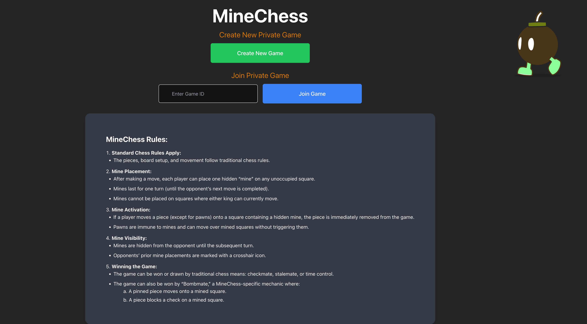
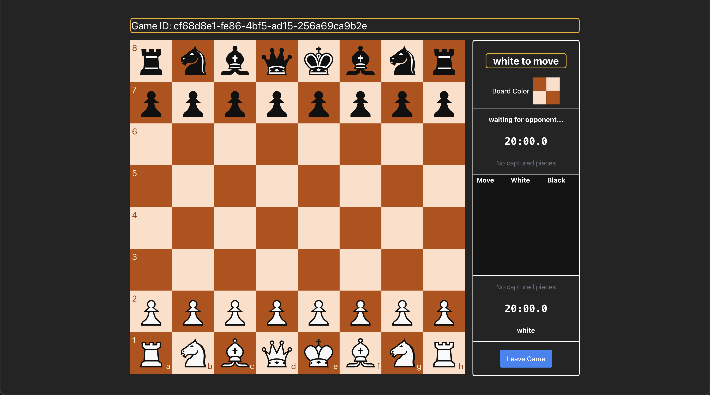

```{r setup, include=FALSE}
knitr::opts_chunk$set(echo = FALSE)
```

# Intro

Minechess is chess with a twist. Each turn, players are able to place a mine at one of the open squares. The location of this mine is hidden to the opponent. If the opponent moves their piece to the location where the mine was placed, their piece is eliminated or removed from the board.

- [MineChess URL](https://minechess.vercel.app/)
- [Custom Color Picker Source Code](https://github.com/thsmale/minechess-color-picker)

This application was primarily developed by [Ben Beisheim](https://github.com/benbeisheim) and [Trevor Woon](https://www.linkedin.com/in/trevor-woon-1a5abb17a/). The rest of this post will focus on my contribution to the application which is the color picker.




## Design/Implementation

Initially I was going to go with the html [input](https://developer.mozilla.org/en-US/docs/Web/HTML/Reference/Elements/input/color) element of type color. However, it was difficult to customize for an optimal user experience on MineChess. So I decided to leverage [React Aria](https://react-spectrum.adobe.com/react-aria/components.html) since these components aligned more with what I was trying to accomplish. React Aria was chosen over React Spectrum because it was more flexible in it's customization options.

One of the main constraints I implemented is a restriction on color selection. Since it's customary for a chess board to have a light and dark side to distinguish between players, users must choose a primary color using the hue slider, then adjust the light and dark variants from that base. This means players can’t make one side green and the other blue. While it’s technically possible to set both sides to the same color, it certainly isn't recommended!

## Usage

Below is a mini interactive example of how the custom color picker works. Make sure to head over to MineChess and play your friends! 

<iframe src="./dist/index.html" width="100%" height="600px" frameborder="0"></iframe>

## Next steps

A future feature to add to the custom color picker would be having the ability to save color combinations you have previously set. Players will be disappointed to find the color combination they created is no longer there when they reload the page. They may not remember what that exact color combo was and may always wish they could recreate that perfect color combo. This could be implemented by utilizing cookies or creating some backend service that stores previously set color combos for the player. 


