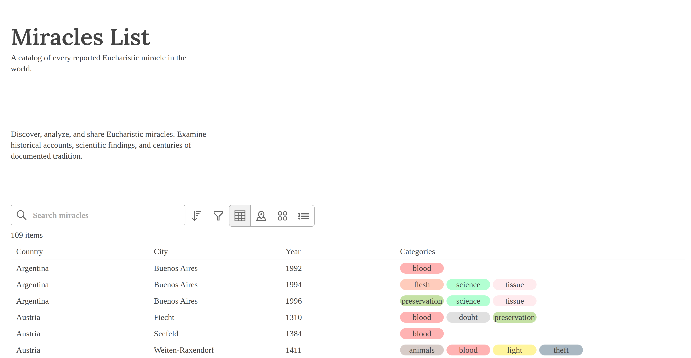
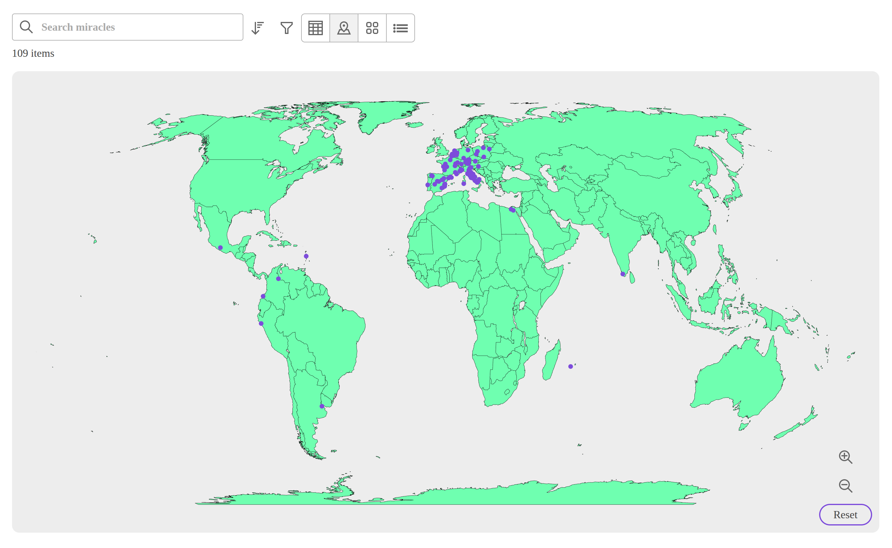
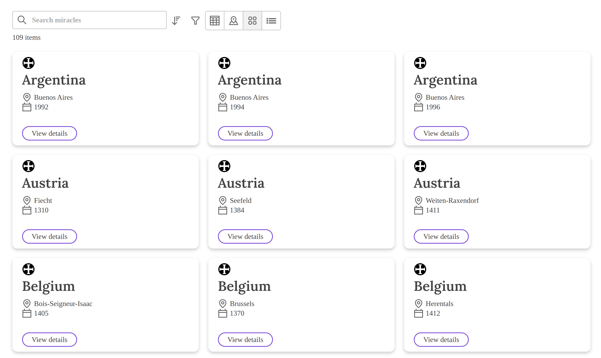
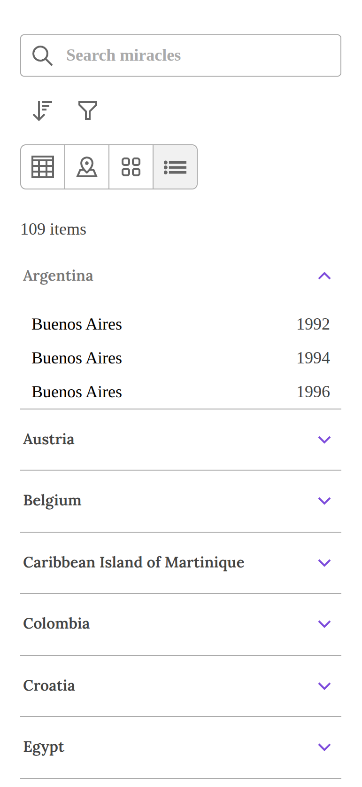
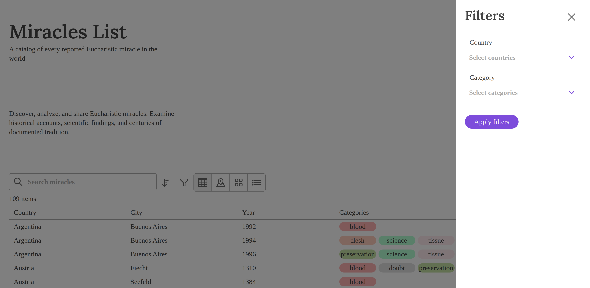
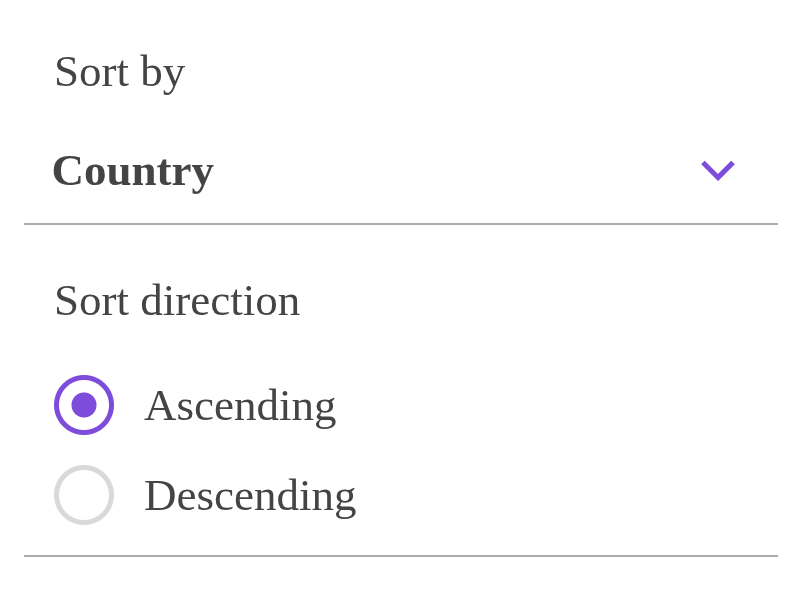
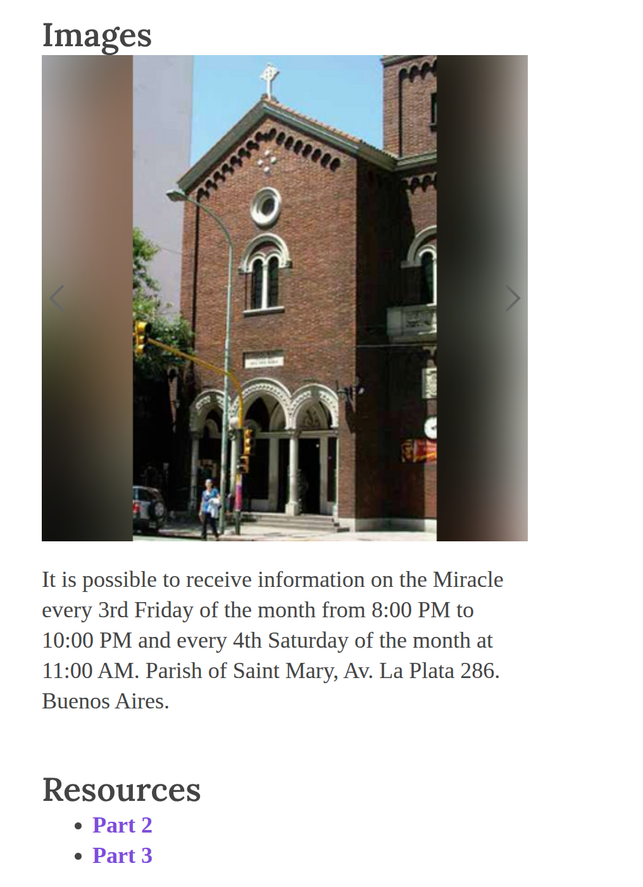

```{r setup, include=FALSE}
knitr::opts_chunk$set(echo = FALSE)
```

Hey you! Before reading this, go check out the [website](https://eucharistic-miracles.net/)!

# Intro
This website is a modern remake of the Saint Carlo Actuis's [original website](https://www.miracolieucaristici.org/). The goal was to create an [open source version](https://github.com/thsmale/eucharistic-miracles-ui) that is more web/mobile friendly and community driven so the website can always be kept up to date with the latest web features.

In the following sections we will show some features of the initial release and discuss some technical details.

## Home page
When the user opens the page, they are greeted with a brief description of the website. This is to provide the user with some guidance on how to use the website. On desktop environments, the data table is shown by default. Users can click on a data table row which will redirect them to the miracle content. There are other views such as a map, cards, and an accordion which will be discussed next.


## Map
Users can change the view from a data table to a map if they are more visual. Then they can zoom in to a particular section of the map and hover or press on a marker. When this happens a [floating-ui](https://floating-ui.com/) tooltip is opened which shows high level details of the miracle. If the user is interested, there is a button in the tooltip so users can navigate to the contents of the miracle.



The map uses [react-simple-maps](https://www.react-simple-maps.io/). This was selected so there is no external API call to a third party service like leaflet. Plus, I was not interested in more detailed features like street names. React Simple Maps uses [GeoJSON](https://geojson.org/) to render the map using SVGs.

## Cards
As another alternative, users can select the cards view from the toggle group if they would like the data to be displayed in this format.


## Accordion
The last option in the toggle group is the accordion view. This was primarily implemented for mobile users. For smaller screens, this or the map is the optimal way to visualize the entire data set.



The libary [react-device-detect](https://www.npmjs.com/package/react-device-detect) was selected so the application can determine whether or not the user is on mobile or desktop. That way when a user is on mobile, the accordion view is shown as above by default. On desktop, the data table is displayed by default.

## Filters
There are a few tools at a user's disposal to find a miracle of particular interest. There is a search bar which uses the miracles meta data to find the right match. Someone could search for a country or city to find if there is a miracle cataloged for that place.

There is also a button which opens a pop up with two multi-selects. Here a user can condense the data set to only show miracles for the country Italy. Perhaps they want to see miracles that have scientific evidence, then they can select the science option under category to show relevant miracles.



There is also a sort feature. Here a user can select what they would like to sort by, such as country, city, year, or categories. Then they can choose to display the data in ascending/descending order. So if they want Venezuela to be the first miracle displayed, they would toggle the descending option in the radio button below.



## Miracles
Now we are getting to the good stuff! When a user has used any combination of the tools above to select a miracle, they are navigated to a new page showing the contents of the miracle. This is essentially a blog post so the UI is similar to that. There is a social bar which allows users to share the miracle via X or Facebook. There is also a PDF button which redirects them to St. Carlo's original website which displays the miracle in a rich PDF.


At the end of every Miracle there are images. This is displayed in a carousel so users can view all the images in a similar format to something like Instagram. Not all images fit the desired size of the carousel. So I used imagemagick to format them all to a consistent size that would fit in the box without changing their aspect ratio. After this, most images still did not fit in the box properly so I used a blurring trick similar to what Instagram uses so the image is presented in a pretty format. The blurring technique works better for some images than others, but is definitely better than something like a black background.



## Deploying the Backend
At the moment when a user navigates to a miracle, a fetch call is made to a JSON file that contains all the contents. The UI then displays the contents of the JSON file in a pretty format. As the backend content is static, I was using nginx locally to serve the static content.

However, as a cheapskate deploying nginx via a Dockerfile can come at a slight cost. For example, the free tier of the web hosting service onrender would spin down the service when inactive. As a result, if a miracle had not been fetched in some time, spinning up the onrender instance again would take a couple minutes. I did not want my end users to have this experience of waiting minutes for a miracle to load.

So I ended up deploying the backend using Cloudflare static pages. This presented me with the next challenge, protecting the data from scrapers. I would be perfectly okay with exposing this data so AI can consume it, but the data is copyrighted and not owned by me. With Cloudflare you get some of the best features available to protect your data from scrapers. I was able to turn some of those protections on, but it was still not sufficient. 
So I deployed a Cloudflare worker which intercepts the fetch request made by the application to get the JSON content or images. I am able to store a secret password for the worker in Cloudflare. Then I set up a Cloudflare WAF rule so that anytime someone tries to fetch the static content, they must provide this secret value or their request will be rejected. There are certainly better ways to do this, like mTLS, but I was looking for a quick solution while collecting initial feedback and there were some compromises that needed to be made when using static pages as opposed to R2 buckets or an API.

## Notable Technical Mentions
The application uses [react-redux](https://react-redux.js.org/) in a few places. For example, it saves what value is selected for the toggle group. That way if a user goes to the map view, selects a miracle, then presses the back button, they still are on the map view. This is also important for keeping the filters state, so if the user only wants to only see miracles for Argentina, they click on Buenos Aires, then go back, the Argentina filter is still applied.

A key component of this website was scroll restoration from [react router](https://reactrouter.com/). Say a user scrolled all the way to the bottom of the list and selected the last miracle displayed. When they return to the miracle list, react router will return them to the end of the list, so they do not have to scroll all the way down again. This is a good UX practice so users can have a smooth experience while using the website.
