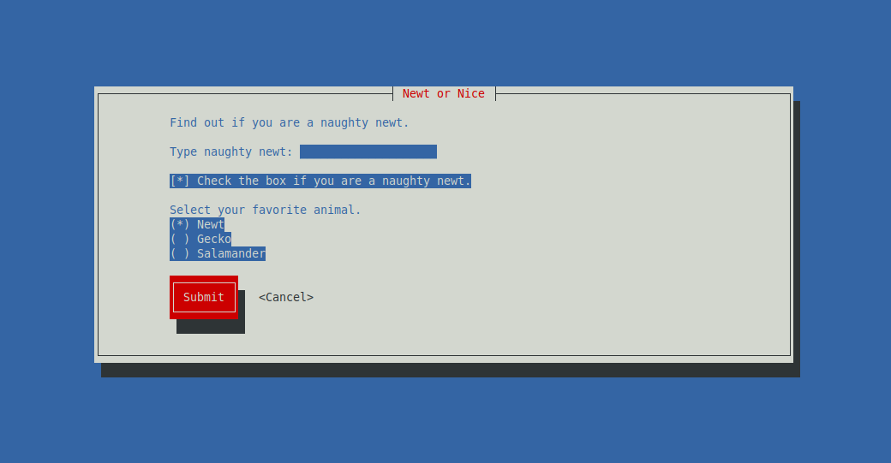
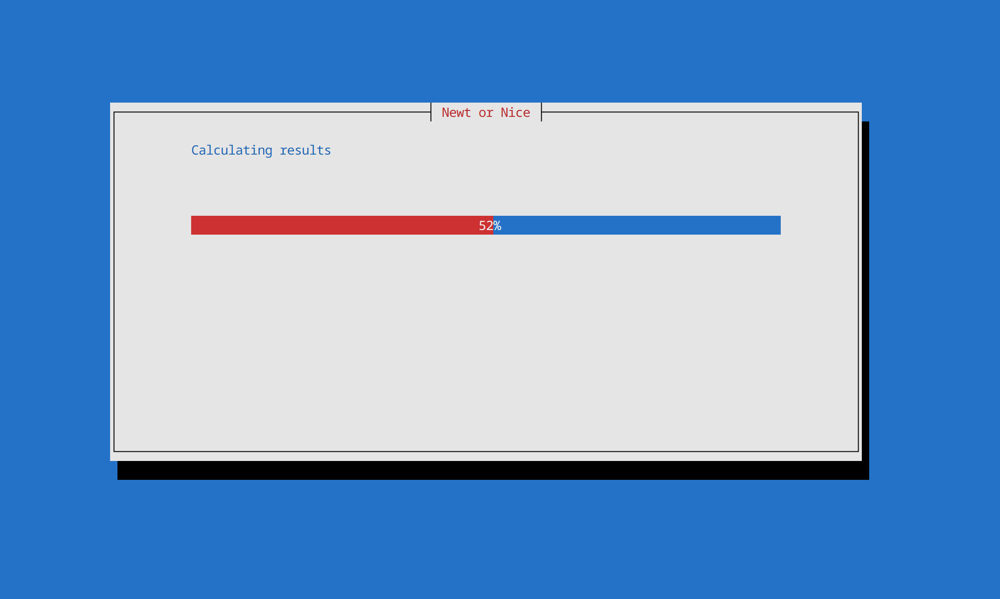
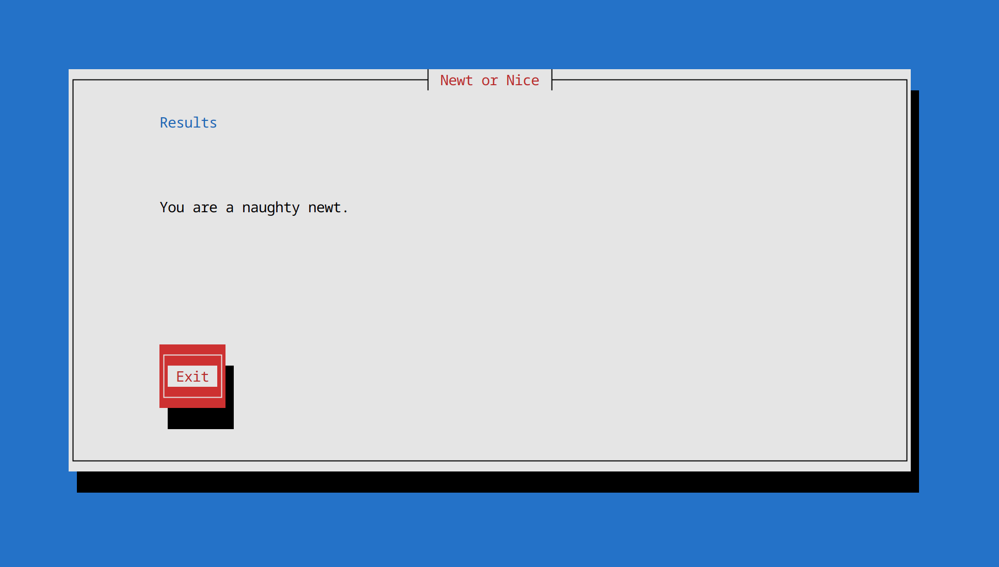

```{r setup, include=FALSE}
knitr::opts_chunk$set(echo = FALSE)
```

# Intro

Naughty Newt is a terminal-based UI application that accepts some input, processes it, then returns whether or not you are a naught newt. Underneath the hood, it uses the [Newt](https://people.redhat.com/rjones/ocaml-newt/html/Newt.html) module and C programming language to build the user interface. Linux administration tools like NetworkManager `nmtui` use software like Newt so a user can configure WiFi connections with a UI.

## Form

The form application uses a few essential Newt components. It uses the form component which can contain multiple sub components used to collect information. The sub components are a text box which is used as a title for the form. A text input to collect information a user types from a keyboard. A check box so the user can set a boolean true/false value. A radio button so a user can select one option from multiple provided options. Then a couple of buttons to submit the form or exit out of the application. The UI components available in Newt are very similar to that of web development!


## Scale

Once a user presses the form submit button, they are presented with a second window that tells the user the application is processing their results. This uses the scale component from Newt which is the same thing as a progress bar. The purpose of this is to simulate that a very complex algorithm is currently processing their results to determine if they are a naughty newt. In reality, there is a very simple algorithm that takes less than a blink of an eye to determine if the user is a naughty newt based on their form results. The progress bar takes a few seconds to complete and over the course of this time it fills out the process bar from 0% to 100%.



## Results

When we are done processing the users input to determine if they are a naughty newt, we display their results in a new window using a text input. There is also a button so the user can exit the application.



## Source Code

Navigate over to the [GitHub repository](https://github.com/thsmale/naughty-newt) to view the source code and run the application on your local computer. In the repository you will see references to Newt guides and documentation to learn how to use the module. There are also several code examples for an entry box, button, radio button, etc so developers can get started quickly to build their own Newt application.