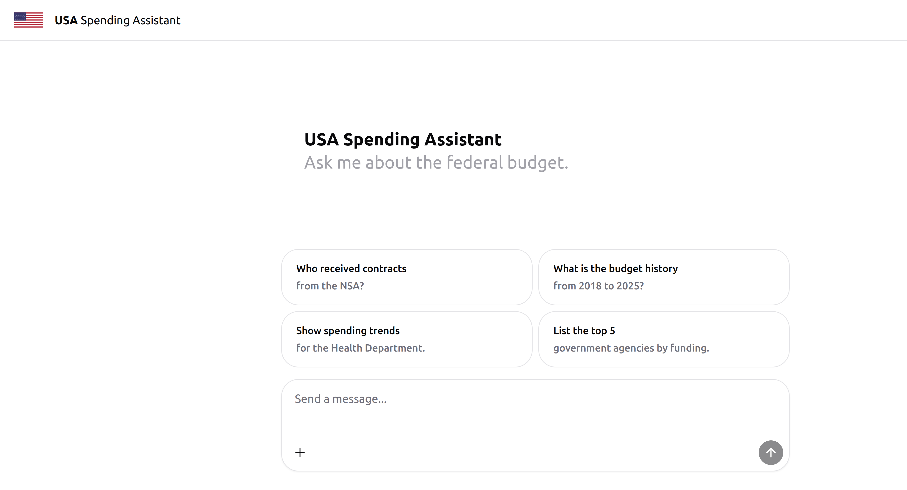
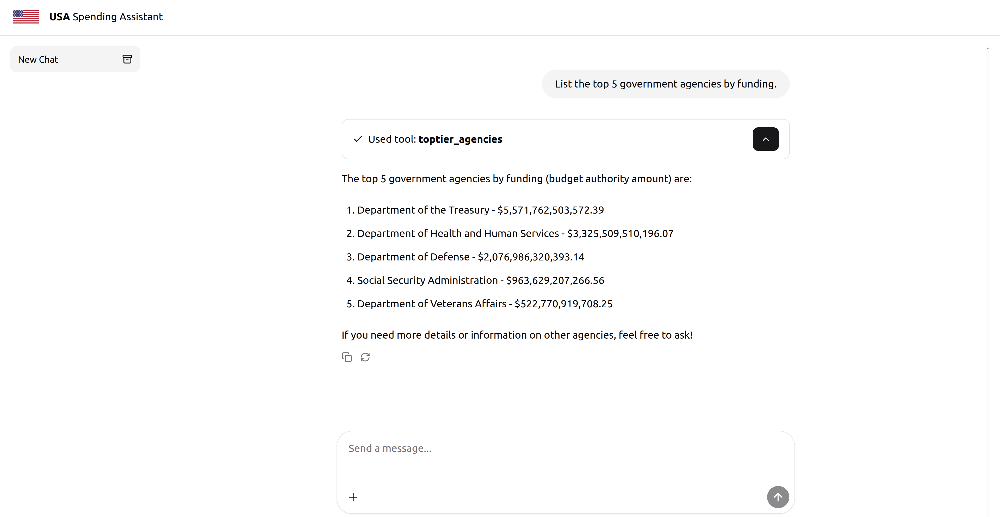
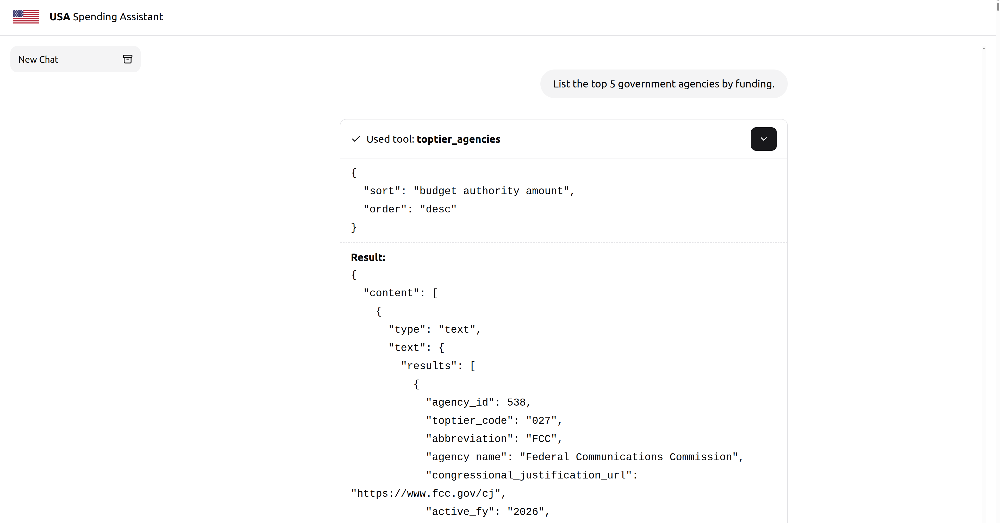

# Intro
This project offers a ChatGPT like user interface and a MCP server so users can interact with the [USASPENDING.gov](https://www.usaspending.gov/), the official source of government spending data. You can track government spending over time, search government spending by agency, explore government spending to communities, and much more.

The power of this is that with an LLM you can utilize natural language to gain better understanding what the federal government spends money on. Here are some example things you can ask the USA spending MCP server:

- Provide specifics on how the Department of Homeland Security spends money.
- How much does the government spend on community and regional development versus international affairs?
- How much money does the Department of Education spend on employee pay and benefits?
- What are some companies that received major federal contracts in Lindsey Graham's district?
- What was the government budget in 2025 vs 2024?

In this post, we will walk you through an example using this service.

## Homepage
When you open up the web application you will see a welcome page. You can start typing your prompt in the text box, or you can click on one of the example cards to send a prompt. The cards are there to provide some guidance to the user on what questions they can ask the USA spending MCP server.

An advantage of building a UI is that setting up MCP servers presents a technical barrier to non technical users. With a hosted user interface, anyone can leverage the powers of the MCP server without any configuration. 

The UI was built using [assistant-ui](https://www.assistant-ui.com/), the UX of ChatGPT in your own app. This framework builds you a decent UI with minimal configuration. It also offers built in integration with the [AI SDK](https://ai-sdk.dev/docs/introduction) by Vercel. This allows you to easily integrate the UI with your MCP server, as the UI acts as the MCP client.

## Example Result
In this example, we clicked on the "list the top 5 government agencies by funding" card in the first image. This then sent that request to the MCP server which fetched the results from the USA Spending service, the LLM processed the results, then returned it to the user. From here, the user could continue to ask further questions, or start a new thread based on a completely different topic.

## Tool Call Details
It is common UX in MCP to show what tool calls the MCP server invoked. This gives the user insight on what the MCP server did in the background. This can be very useful in applications where your MCP server can modify data. For example, if you wanted to use an MCP server to delete a user from the database, and all the LLM returned was user deleted, you could inspect the tool call and result to confirm the LLM deleted the correct user.

In the following example you see what tool was invoked, what arguments were passed to the tool, and the raw response from the MCP server. This raw response was processed by the LLM and presented in a clean format as shown in the previous image.

## Source Code
The source code for the MCP server can be found [here](https://github.com/thsmale/usaspending-mcp-server). You can see the source code for the UI [here](https://github.com/thsmale/chat-mcp). In both GitHub repositories, you will see instructions on how to configure the UI and MCP server to work together.