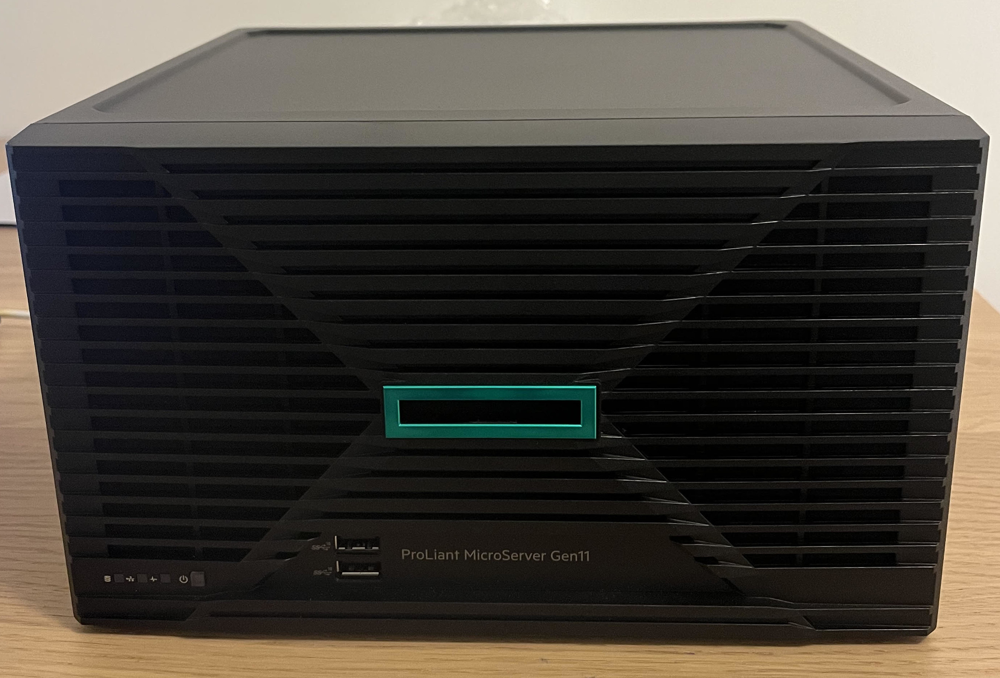
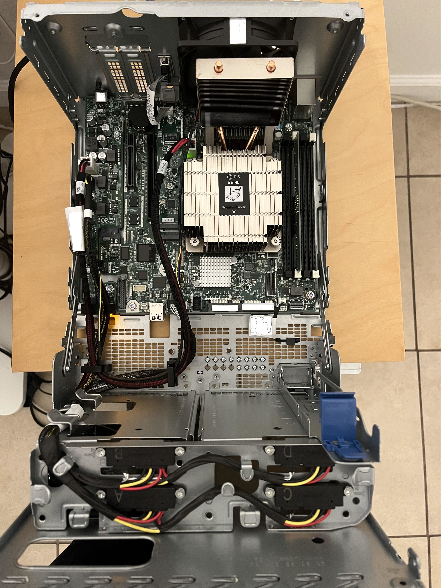
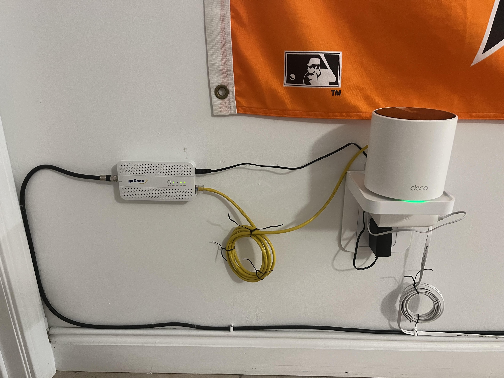
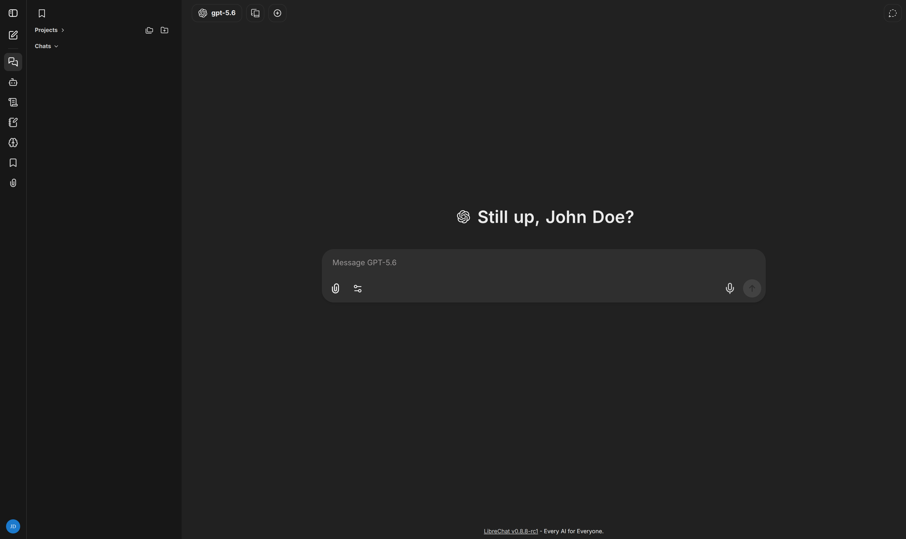

```{r setup, include=FALSE}
knitr::opts_chunk$set(echo = FALSE)
```

# Introduction
This blog will highlight the process of taking a brand new HPE ProLiant Microserver Gen11 and configuring it to run an application on LAN.
To do this one must understand how to configure the server, deploy an operating system, and securely run an application with high up time.
The goal is to create a self hosted service that will bring together all of of one's AI conversations in one unified, customizable interface.
By using the following tech stack, this will become a reality!

## Tech Stack
- [Rocky Linux](https://rockylinux.org/)
- [Docker](https://www.docker.com/)
- [LibreChat](https://www.librechat.ai/)
- [Let's Encrypt](https://letsencrypt.org/)
- [Nginx](https://nginx.org/)
- [Dnsmasq](https://thekelleys.org.uk/dnsmasq/doc.html)
- [Firewalld](https://firewalld.org/)

## HPE ProLiant Microserver Gen11
The ProLiant is a reliable machine that should run for at least a decade.
It is designed for edge locations, i.e a retail store, which means it has a minimal form factor that can easily fit in a house.



There are many other alternative home servers that are more budget friendly and comparable in performance.
For example, there are raspberry pi's, old laptops/desktops that can be re-purposed, or pre owned servers available for sale on the internet.
However, one may overlook these more rational options if they are an HPE employee with lots of pride.

## First power up
HPE has a [user guide](https://support.hpe.com/hpesc/public/docDisplay?docId=sd00003930en_us&page=index.html) which is the ultimate source of truth for configuring a new server.
As the official documentation is very bland, perhaps one will enjoy this additional commentary below.

### Learning about the machine
A good starting point is to read the [component identification](https://support.hpe.com/hpesc/public/docDisplay?docId=sd00003930en_us&page=GUID-EE01917A-7A0D-4B8B-ACEC-756FC95CB3F8.html) section.
Here, one can learn the basics of the server, such as what the LED lights mean, what hardware is supported (i.e storage, memory, expansion slots), and how to open up the server to change any of these hardware configurations (like adding more memory). The [hardware options installation](https://support.hpe.com/hpesc/public/docDisplay?docId=sd00003930en_us&page=GUID-F50A7515-5033-4726-86DB-573C0A36C776.html) contains more pertinent information as well.

### Hardware validation
Subsequently one can move on to [setting up the server](https://support.hpe.com/hpesc/public/docDisplay?docId=sd00003930en_us&page=GUID-CF3588EB-842C-4831-A967-317926D44EED.html).
At this stage one can turn on the device to boot into the system utilities.
From here, there are hardware diagnostics tests, which is a good practice to make sure all components are functional.
The system may still be covered by warranty so any defects can be refunded.
Also, it provides assurance that the hardware is not at fault if one encounters any problems in the next steps.

One can connect a monitor, mouse, and keyboard to navigate the server start up menus.
Note that all the peripherals will need to be connected via a wire to the server.
Without any OS installed, there are no Bluetooth device drivers loaded.



### iLO
Now that that all components on the system have been validated as operational, it is best to setup iLO before installing an OS.
iLO provides key insights regarding the status of the server.
One can see power settings such as the temperature of the CPU, the speed of the fans, and whether or not the server is turned on.
With iLO, an IT guy can review or modify any of these configurations for a server sitting in a coffee shop from a remote location, like India.
iLO is a separate chip on HPE servers that run independently of the OS, so if the OS has crashed, iLO is still accessible.

#### MoCA sidequest
To setup iLO one is going to need an Ethernet connection, as the server does not come with a WiFi capability by default.
An internet connection is required since iLO is for remote management, so one can see the health of the server from another computer (whether that be on LAN or WAN).
Unfortunately, the installation location only had two coaxial cords and zero Ethernet cables.
Since the server does not have a coaxial port, once can use a technology called MoCA, which can simulate an Ethernet connection over a coaxial cable.
Below you can see part of the MoCA setup.




The coax cable feeds into the goCoax device which is connected to the WiFi mesh pod via an Ethernet cable.
Then, the white Ethernet cable connects the server directly to the WiFi mesh pod.
As a bonus, there is now an Ethernet back-haul for this WiFi mesh pod, which results in improved speed and stability.
Note that setting up MoCA may require certain coaxial splitters that can accommodate the protocol.
It will likely require the purchase of a point of entry filter so that no connections transmitted via MoCA leave the LAN and accidentally wind up in a neighbors network.

#### Actual iLO setup
Now that there is an Ethernet connection to the server, iLO is ready to be setup.
After booting up the server, the router successfully assigned iLO an IP address via DHCP.
A static IPv4 address can be assigned to iLO, so that the iLO dashboard can constantly be accessed from the same IpV4 address.
After that, the default iLO username and password can be found at the bottom of the server to log in.
Once one has become comfortable with the iLO dashboard, there is an `Information -> Security Dashboard` page that should be reviewed.
This provides one with guidance on how to protect the server, such as changing the default iLO password, adding a SSL certificate for iLO, or enabling global component integrity.

## Deploying an OS
HPE has a list of [supported operating systems](https://www.hpe.com/us/en/collaterals/collateral.a50010841enw.html).
It is important to stick with one of these operating systems because at a later step proprietary HPE drivers and firmware will be installed.
Since the OS is supported, one can rest assured that any proprietary HPE software will run smoothly on the OS.
REHL or SUSE are most common Linux distrubtions for HPE servers, however as a homelabber, Linux community editions are a feasible alternative.
Rocky Linux can be a good pick over CentOS since it is bug-for-bug compatible with stable branches of REHL and the OS will not be a testing ground for future releases of REHL.
It also enables one to leverage many of the great open source REHL guides.

When downloading a Rocky Linux ISO, there are two primary options, DVD and boot ISO.
The DVD ISO is a larger download but comes bundled with all the packages.
The boot ISO will prompt one for a URL to fetch any additional packages required for an OS installation.
Once the ISO download is complete, one can use [balena-etcher](https://github.com/balena-io/etcher) to flash a USB drive and boot from that.
Rocky Linux 10 has an [installation guide](https://docs.rockylinux.org/10/guides/installation/) one can follow.
During installation one can install an OS of various sizes like a minimal CLI only, a very slim GUI, or a full workstation (which comes with common GUI apps like GParted).
For a non prod server that will be used for tinkering, a GUI is nice to have.
However, for a critical production server having no GUI may be a better choice to reduce the attack surface.

### Backups
Now that there is a successful fresh OS install, it is a decent practice to create a snapshot of the initial state.
The purpose of this is so that if anything breaks while tinkering around, the OS can be reverted to a fresh state.
Backups also become more critical as databases or other important configuration files for services are added.
A simple way to perform a system backup is via [tar](https://docs.rockylinux.org/10/guides/backup/tar/).
For taking the backup, a USB drive can be flashed with an OS that can then be booted from.
Since the primary OS filesystem is then unmounted none of the temporary files like /tmp are included in the backup.
Also, one does not have to worry about the OS changing something mid backup that would not be captured.

### Installing proprietary HPE software
A lot of the drivers and firmware that came with the server were outdated.
HPE has a tool called [Service Pack for ProLiant (SPP)](https://www.hpe.com/servers/spp/download) to find the newest software available for a server.
Once the appropriate software bundle is downloaded, a tool like [Smart Update Manager (SUM)](https://www.hpe.com/info/sum-docs) can install the software on the server.
SUM can be accessed via a localhost URL on the server which contains a dashboard to guide one through the software installation process.
It will recommend which drivers should be installed, for example, HPE's Nvidia GPU drivers are only recommended if Nvidia GPUs are present in the system.
Other than updating all the necessary drivers and firmware, there is other proprietary software from HPE such as Agentless Management Software (AMS) for increased observability of the server.
Since the software was updated, another backup was taken so the OS can be reverted back to this state at any time.

### Deploying services with Docker
Now that the server hardware has been validated, iLO has been added for oberservability, and there is a fresh OS install, it is time to finally deploy some applications!
One of the advantages of Docker is that it resolves the "it only works on my machine" dilemma.
More relevant for this case, Docker has services all bundled up and ready to be deployed with just a few commands in a terminal.
Out of the box, Docker will give services moderate isolation, so if one service is hacked it will mitigate the ability for the infected service to spread across the rest of the machine.
There is a [Docker security guide by OWASP](https://github.com/OWASP/Docker-Security) that provides some guidance to harden Docker services from attacks.
For example, taking care to ensure Docker images do not run with sudo access and have RO access to any mounts.

#### LibreChat
The first service deployed via Docker was LibreChat.
LibreChat provides a fantastic UI that enables one to use any of the major LLM providers, upload images, and store sessions for multiple users.
Since it is bundled up with Docker, in just a couple CLI statements one can deploy this application that will run on localhost.

#### Nginx
The plan is to eventually deploy multiple services via HTTPS.
By utilizing docker images from Nginx with some custom configuration I am able to set up a reverse proxy.
Now a single URL can route to many different services, i.e movies.domain.com, files.domain.com, etc.
In addition, only Nginx needs to be exposed externally, so all services it proxies can be inaccessible from outside the server, which is a security plus.

### Let's Encrypt
The intention is that all services can run on HTTPS without any security warnings like, "This Connection Is Not Private".
This will mitigate MITM attacks and increase the level of trust users have in the services.
One can generate a TLS certificate locally, however the certificate would need to be installed on every computer in the LAN to resolve any browser warnings.
Let's Encrypt will generate a certificate signed by a CA that is trusted by default on almost every common machine, so nothing needs to be installed on any clients computer to access the services securely.

To use Let's Encrypt one will need to own a domain.
If one acquires a domain through a service like Cloudflare, the TLS private key will not even be accessible to the domain owner.
However, by providing Let's Encrypt an API token from Cloudflare that demonstrates the machine controls the domain, one can use the free service to create a TLS cert/key that will be trusted by most common browsers.
A service like Nginx can now use the TLS certificate so clients can access the server via HTTPs.

### Dnsmasq
Asking clients to type in the IpV4 address for the LibreChat service is unacceptable.
Instead, clients will expect a human readable domain name to type into their browser.
With Dnsmasq, when a user types in the domain for LibreChat, it will be resolved, even though it is only accessible via the LAN.
As previously mentioned, LibreChat is running on localhost within the server.
Dnsmasq can be configured to read the `etc/hosts` file so an entry can be added to map the domain to the Ipv4 of the server.
There are also a couple other advantages of Dnsmasq.
It has a caching capability, so DNS queries are resolved much faster on the LAN.
Before, a new URL like hpe.com could take 80 msec to resolve, when it is already cached, it can be resolved in 2 msec.
Also, for URLs not in cache, Dnsmasq can query multiple DNS servers like Cloudflare and Google simultaneously then return the resolution for whichever DNS server responds first.
DNSSEC can also be configured, while many common services do not use this, it is nice to have to mitigate DNS Cache poisoning.

### Firewalld
Now an OS is installed, docker services are running, the gateway is setup, and there is DNS resolution.
Surely, LibreChat must be accessible to clients via the domain name by now right?!
Nope, there is still one last barrier, Firewalld.
While everything is running within the server, none of these services are accessible outside of the server due to the firewall.
This is a default security setting to prevent unauthorized access to a system and the applications running on it.
In short, Firewalld needs to be configured to allow requests from an IP address on the LAN subnet range for DNS port 53.

## Conclusion
Hurrah!
Now there is finally a self hosted web application, LibreChat, that guests can access via HTTPS without browser warnings.
As an added bonus the LAN is faster thanks to the DNS caching service from Dnsmasq.
In reality, no one else will notice the benefits of DNS caching, or use LibreChat, and managing all this will likely cause headaches down the line.
However, the knowledge gained from setting up a server and managing it is invaluable 🤠!




### Next steps
- Find more valuable services to deploy.
- Automate backups (not to mention testing restores).
- Leverage Ansible so this setup can be deployed to one or more OS's in the future.
- Utilize virtual machines.
- Ensure all services spin up again after a reboot.
- Expose a service on the WAN.
- Explore security enhancements.


